<!-- ” -->
<!-- “ -->
<!-- „ -->

# Strategische Studien II

Militärakademie (MILAK) an der ETH Zürich  
Vorlesung Strategische Studien II  
Dr. Marcel Berni

_Der Wanderer über dem Nebelmeer Caspar David Friedrich, 1818_

## Einleitung

### Lernziele

- Die Studierenden kennen wirkmächtige Konzepte (militär-)strategischer Theorie und Praxis. Sie lernen, wie sich das Verständnis von Strategie über die Zeit verändert hat.

- Die Studierenden können aktuelle Kriege und Konflikte aus verschiedenen Perspektiven einordnen und die jeweils verfolgten Ziele der verschiedenen Akteure diskutieren.

- Die Studierenden können die in der Vorlesung behandelten Theorien und Fallbeispiele miteinander vergleichen und gegebenenfalls zueinander in Beziehung setzen. Zudem lernen sie, Originaltexte und Fachpublikationen auf dem Gebiet der Strategischen Studien kritisch zu hinterfragen.

### Strategie, Operation und Taktik

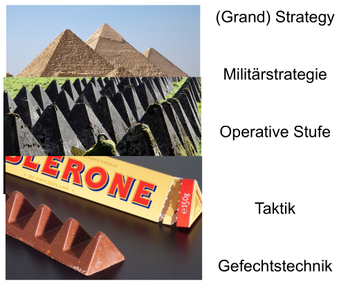

> Mit Taktik gewinnt man das Gefecht, mit Operationen einen Feldzug und mit Strategie einen Krieg.  
> \- _Gustav Däniker, Schweizerische Selbstbehauptungsstrategie im Kalten Krieg, Frauenfeld 1996_

### Strategie und Theoriebildung

> In theory there is no difference between theory and practice. In practice there is.  
> \- _Strategic Theory for the 21st Century: The Little Book on Big Strategy 2006_

> Strategic theory in the real world confronts the dynamic nature of the strategic environment and the mind of the strategist - how strategists approach strategy-making in the context of their strategic environments. \[…\] Good strategy flows from understanding the nature of the environment and creating a symmetry and synergy of objectives, concepts, and resources that offer the best probability of achieving the policy aims. The strategist is assisted by the logic of strategy and the construct of planning, but the strategist is not a planner.  
> \- _Harry R. Yarger, Strategic Theory for the 21st Century: The Little Book on Big Strategy, Carlisle 2006_

> Theory provides guidance for what usually would be sound behavior, but, as well as a gamble, war is also an environment wherein exceptions can and do occur.  
> \- _Colin S. Gray, Theory of Strategy, Oxford 2018_

### Gray, Modern Strategy, Oxford 1999

> Overall, strategy is where policy meets the battlespace \[…\] On the strategy bridge, the strategist must translate political desires into plans for their realization. \[…\] Strategy is only the bridge connecting the world of tactical engagement with that of political purpose.  
> \- _Colin S. Gray, Fighting Talk. Forty Maxims on War, Peace, and Strategy, Westport-London 2007_

- Krieg und Strategie als ganzheitliches Phänomen: 17 Dimensionen in 3 Clustern
- Dimensionen zeitlos gültig, Wirkung variiert je nach Konflikt, deshalb keine Hierarchisierung
- Bedeutung der Dimensionen
  - Exzellenz in allen Dimensionen nicht notwendig (Möglichkeit zur Kompensation)
  - Dramatische Verbesserung in einem oder zwei Bereichen garantieren keinen strategischen Erfolg
  - Katastrophale Schwäche in einzelner Kategorie kann tödlich sein
- Der Master Stratege beherrscht alle Dimensionen.

#### People and Politics

##### People

##### Society

##### Culture

##### Politics

##### Ethics

#### Preparation of War

##### Economics and Logistics

##### Organization (incl. Defence and force planning)

##### Military administration (incl. Recruitment, Training, Armaments)

##### Information and Intelligence

##### Strategic Theory and Doctrine

##### Technology

#### War Proper

##### Military Operations

##### Command (political and military)

##### Geography

##### Friction (incl. chance and uncertainty)

##### Adversary

##### Time

### Mittel, Wege und Ziele

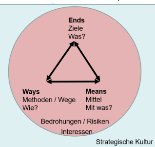

> Strategy equals ends (objectives toward which one strives) plus ways (courses of action) plus means (instruments by which some end can be achieved).  
> \- _Arthur F. Lykke, Towards an Understanding of Military Strategy, 1984–1985_

### Modernes Strategieverständnis

Wie erreicht man seine Ziele gegen einen (bewaffneten) Gegner?

- (Politische) Festlegung und Verfolgung eines Ziels
- Formulierung und Anwendung eines Plans, unter Berücksichtigung des Gegners und Hindernisse
- Einsatz offener und verdeckter (Macht-)Mittel, Methoden und Wege

> **Eine Strategie ist ein Plan über den Mitteleinsatz zur Zielerreichung unter Berücksichtigung der gegnerischen Strategie sowie externer Faktoren.**

### Methodische Grundprobleme

- Informationsbasis und deren Messbarkeit: keine exakten Daten für die Vergangenheit, nur Annahmen für die Zukunft
- Veränderlichkeit der Komponenten (z.B. Ziele, Wege, Mittel) im Untersuchungszeitraum
- Interaktion mit dem Gegenspieler (mit eigener Strategie und Friktion)
- Deklaration und Aktion: Notwendigkeit der Unterscheidung
- Erfolgsmassstab: abhängig von Beobachter und Zeitpunkt

### Repetition SSI

- Begriffe "Strategie" und "Taktik" sind antik (5. Jh. v. Chr.), aber nur Taktik ist damals gebräuchlich.
- "Strategie" kommt Ende 18. Jh. in Gebrauch.
- Strategie und Taktik sind ursprünglich geographisch voneinander getrennt. Allmählich kommt eine hierarchische Trennung hinzu, in welche sich im 20. Jahrhundert die "operative Stufe" einfügt.
- Die Diskussion, ob Strategie eine Wissenschaft, eine Kunst oder ein Plan ist, ist bis heute nicht entschieden. Es gibt verschiedene Formen der Visualisierung von Strategien.
- Ab Mitte 20. Jh. wird "Strategie" zunehmend der politischen Führung zugeordnet, während die militärische Führung nur noch für "Operationsführung" und Taktik zuständig ist.
- In den 1960er Jahren übernehmen die Wirtschaftswissenschaften das Konzept der Strategie.
- Der heutige Sprachgebrauch ist kontextabhängig und mitunter beliebig.
- Das Adjektiv "strategisch" wird oft synonym mit "auf oberster Stufe", "umfassend", "langfristig" oder "überragend wichtig" verwendet. Bei Waffensystemen wird damit die Reichweite bezeichnet.

#### Kriegsursachen, Siegestheorien und Kriegsbeendigung

- Thukydides: Angst/Furcht, Ehre/Ehrgeiz, Interessen/Gier als Kriegsursachen, Unterscheidung Kriegsursachen vs. Kriegsgründe
- Clausewitz: Krieg als Chamäleon das zwischen Regierung, Volk, Feldherr/Heer mit jeweils unterschiedlichen Attributen oszilliert, Krieg als einfacher oder erweiterter Ringkampf
- Bartholomees: Kontinuum Sieg von Sieg zu Niederlage, Taktische und operative Erfolge resultieren nicht automatisch in strategischem Sieg! Decisiveness und Achievement als Indikatoren
- Lee/McDonnell: Resultatorientierte Siegestheorie, die gewisse Kriegsausgänge (z.B. Patt) marginalisiert.

#### Der Indirekte Ansatz

- Indirekter Ansatz als Gegenstück zum Frontalangriff, Ausgerichtet auf Schwachpunkte des Gegners, Umgehung seiner Stärken
- Zwei Grundformen (kriegsverkürzend/kriegsverlängernd) mit unterschiedlichen Zielen, Vorgehensweisen und Anforderungen, Gemeinsamkeit: Sieg ohne Schlacht
- Kann zahlenmässige bzw. materielle Unterlegenheit wettmachen, aber mit Risiken verbunden

#### Strategien im napoleonischen Zeitalter

- Jomini: Grosser Einfluss auf Denken und Operationsführung in USA bis 1861/65, bei europäischen Armeen bis 1914
- Clausewitz: Grosser Einfluss auf strategisches Denken im 20./21. Jahrhundert
- Jomini: Suche nach "ewigen" Prinzipien und Regeln
- Jomini’s Abriss der Kriegskunst hat den Amerikanern die französische Doktrin erschlossen, und zwar für terrestrische, maritime und amphibische Operationen sowie die Rolle der Logistik
- Clausewitz: Dynamik, Dialektik, Irrationalität, höhere Gewalt (force majeure)
- Rezeption: "Inflation" technischer Begriffe mit teilweise unscharfer Definition und in schwankender Verwendung

#### Clausewitz: Friktion, Schwerpunkt und Kulminationspunkt

- Unterscheidung absoluter/wirklicher Krieg, letzterer geprägt von politischem Zweck und Friktion
- Faktor Mensch (Intuition, Erfahrung, Moral etc.) entscheidend bei Clausewitz
- Friktion allgegenwärtig, moderne Technologie bietet gewisse Abhilfe, schafft zugleich aber neue Anfällig- und Abhängigkeiten
- Unterschiedliches Verständnis bzw. Konzeption von Schwerpunkt/Center of Gravity
- Kulmination aus Kombination verschiedener Faktoren, erfordert sorgfältige Planung und Flexibilität

#### Simulation, Kriegsspiel und Operations Research

- Verschiedenste Formen der Modellierung und militärischen Simulation
- Ziel: Entscheidungen auf allen Stufen spielerisch simulieren
- (Preussisches) Kriegsspiel setzt sich im 19. Jahrhundert durch
- Weiterentwicklungen: Operations Research, Lanchester’s laws, Tactical Numerical Deterministic Model, Sigma War Games
- Ambivalenter Einsatz in Vergangenheit und Aktualität
- Interdisziplinäre Befruchtung, keine disziplinäre Vormachtstellung
- Enge Zusammenarbeit zwischen militärischen und zivilen Stellen
- Aktuell: Simulationen wieder im Trend
- Zukunft: Computerisierung und AI

#### Allianzen, Kooperationen und Gleichgewicht der Kräfte

- Allianzen und Bündnisse als zeitlose Problemstellung – Abwägung von Kosten und Nutzen, Vor- und Nachteilen
- Tendenz zu ad-hoc Koalitionen angesichts neuem Grossmachtwettbewerb möglicherweise wieder rückläufig
- NATO als Sonderfall, aber mit ungewisser Zukunft
- Kooperation mit und unter nicht-staatlichen Akteuren mit denselben Logiken und Dynamiken

#### Überraschung, Täuschung, Nachrichtendienst

- Militärische Überraschung und Täuschung als potenzielle Kräftemultiplikatoren, allerdings oft mit nicht beabsichtigten Nebeneffekten
- Täuschung letztlich kognitives Phänomen, bedingt vertiefte Kenntnisse der anderen Seite
- Nachrichtendienstliches Versagen vielschichtig, vermutlich auch in Zukunft unvermeidlich

#### Der Einfluss von Kultur und Technologie

- Konzept der strategischen Kultur wird wichtiger in den Strategischen Studien, Operationalisierung, Definition und Methodik bleiben jedoch heterogen
- Strategische Kultur als ergänzender Erklärungsansatz für Unterschiede zwischen Armeen und Militärbürokratien
- Konnex zwischen strategischer Kultur und militärtechnologischem Einsatz evident, iterative Beeinflussung
- Entwicklung neuer Waffensysteme benötigt viel Zeit, Geld und Personal. Gleichwohl sind sie für Staaten von strategischer Bedeutung
- Aktuelle Forschung stellt RMA als dominanter Erklärungsansatz vermehrt in Frage

#### Seekriegführung

- Sea Control/Sea Denial bzw. Nutzung SLOCs als anhaltende Grundherausforderung maritimer Strategie und Seekriegführung
- Klassische Rollen Seestreitkräfte mehrheitlich fortbestehend bei gleichzeitiger Erweiterung Missionsspektrum
- Uneingeschränkte Dominanz US-Navy künftig vermutlich zunehmend infrage gestellt

#### Luftkriegführung

- Potenzial Luftkriegsführung und Luftmacht frühzeitig erkannt, Wirkung von strategischen Bombardierungen aber über- und Luftverteidigung unterschätzt
- Debatte um effektivste Anwendung (strategisch vs. taktisch-operativ) weiter anhaltend
- Air Power wirksam und unabdingbar im Verbund, kann bewaffnete Konflikte aber nicht im Alleingang entscheiden
- Aktuelle Drohnengeneration noch kein Ersatz für Kampfflugzeuge, aber nächste Generation bereits in Entwicklung

#### Landkriegsführung

folgt...

#### Nuklearstrategie & Massenvernichtungswaffen

- Hoch hypothetische Wissenschaft (zum Glück!)
- Abschreckung als zentrales Element
- Wechselseitige Interaktion, Kommunikation über Absichten entscheidend
- Spezifische Denkfiguren und Paradoxien
  - garantierte Zweitschlagfähigkeit sorgt für Stabilität
  - Irrationalität erhöht Glaubwürdigkeit
  - Extended Deterrence
- Basiert nur auf theoretischen Annahmen
- Stigmatisierung von Kernwaffen betrifft Demokratien, nicht aber Diktaturen
- Besteht das nukleare Tabu auch im zweiten Nuklearzeitalter?

## Joint Warfare

Wirkungsraumübergreifende Kriegführung

### Leitfragen

- Welche strategischen Konzeptionen wirkungsraumübergreifender Kriegführung gibt es?
- Wie gestaltet sich der Kampf der verbundenen Kräfte in der wirkungsraumübergreifenden Kriegführung?
- Welchen Herausforderungen sieht sich die wirkungsraumübergreifende Kriegführung ausgesetzt?

### Lektüre

- Hew Strachan, One War, Joint Warfare, in: The RUSI Journal, Vol. 154 (4), 2009, S. 20-24.
- Edward R. Lucas/Thomas A. Crosbie, Evolution of Joint Warfare, in: Anders McD Sookermany (Hg.), Handbook of Military Sciences, online first, <https://doi.org/10.1007/978-3-030-02866-4_21-1>.

### Begriffsverwendung

Es gibt keine klare Definition und vielfach unterschiedliche Verwendung des Begriffs.

- Kampf / Gefecht der verbundenen Kräfte / Waffen
- Multi / All Domain Operations
- Joint Warfare
- Cross Domain Operations
- Integrated Operations
- Network-centric Warfare
- Effects-based Operations
- Comprehensive Approach
- Distributed Operations
- Cyber-physical Operations
- Full spectrum warfare

Wir definieren die wirkungsraumübergreifende Kriegsführung als koordinierte militärische Operationen verschiedener Teilstreitkräfte, die zwei oder mehr Operationsräume miteinander verbinden.

### Anfänge

- Französische und deutsche Offiziere versuchten im 1. WK Schützengräben zu überwinden
- Stosstrupps, flexible Flächenverteidigung und später Panzerwaffe
- Kommunikation zwischen unterschiedlichen Waffengattungen (primär Artillerie und Infanterie)
- Ziel: Synchronisation und Steigerung der Feuerkraft und Bewegung
- Flankierung durch Keilformationen und Kesselbildungen
- Erweiterung im 2. WK um Flugzeuge, Flugabwehr, Panzer
- Später: Elektromagnetische Kriegführung, Cyber und Krieg im All

### AirLand Battle (1982/86)

- Offensive Ausrichtung, Manöver statt Abnutzung, Follow-on-Forces-Attack, Deep Attack
- Extended Battlefield durch Kampf der verbundenen Waffen und Synchronisierung von:
  - Close Operations
  - Deep Operations
  - Rear Operations
- Erlangung Initiative durch Tempo, Überraschung und Täuschung sowie Flexibilität
- Bezüge zu Clausewitz (Center of Gravity, Culminating Point) /Liddell-Hart (Indirect Approach)
- Paradebeispiel "Desert Storm" (1991)

### Network-centric warfare und Effects-based Operations

Denkmethodik: Effekte - Systemanalyse - Wahl der Mittel aus gesamtem Spektrum, fein dosiert und mit Priorisierung der zivilen/psychologischen Mittel

- Zentrale Stellung in US- und NATO-Doktrinen
- Schmale empirische Basis für Überprüfung
- Technologiegläubigkeit
- Anfälligkeit für übersetzte Erwartungen

### Effects-based Operations

> Any political entity can be thought of as a system consisting of a number of subsystems, or to borrow a term coined in the former Air Force Systems command – a system of systems.

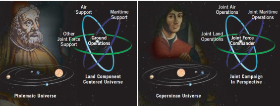  
_Vergleich mit Entdeckung der tatsächlichen funktionsweise der Umlaufbahn_

> Effective control of enough of the adversary’s enabling operation level systems will paralyse his ability to function at the strategic level.  
> \- _David A. Deptula, Effects-based Operations: Change in the Nature of War, Arlington 2001._

### Multi Domain Operations (2016)

Neuausrichtung von Aufstandsbekämpfung auf konventionellen Gegner mit fortschrittlichen Fähigkeiten insbesondere im Bereich A2AD (anti-access, area denial)

Unterschied zu Joint Operations: MDO inkludiert nicht-militärische Assets

- Veränderte Bedrohungslage
  - Neue chinesische Bedrohung
  - Krim-Besetzung 2014
  - Tendenz zu neuem Grossmachtwettbewerb
- Abfolge MDO:
  - Penetrate
  - Dis-integrate
  - Exploit
  - Re-compete

### Anwendung

#### NATO Joint Warfare Center Stavanger (NOR)

- Gründung: 23.10.2006
- Teil des Supreme Allied Commander Transformation sowie United States European Command
- Tätigkeitsfelder
  - Schulung, Übungen und Doktrinüberprüfung in JW
  - Entwicklung Szenarien in JW (Joint Warfare)

> The JWC is NATO’s training focal point for full-spectrum joint operational- and strategic-level warfare.

#### MDO in der Bundeswehr

> MDO umfassen die dimensionsübergreifende (Domänübergreifende) Zusammenführung von Sensoren, Effektoren und Unterstützungsleistungen unter einheitlicher Führung zur Erzeugung von Wirkungsüberlegenheit auf taktischer Ebene. MDO erfordern die Kombination aus Wirkung und Schnelligkeit im direkten und indirekten Ansatz unter Berücksichtigung ganzheitlich-operativer Massstäbe durch letale und nicht-letale, kinetische und nicht-
> kinetische Effekte über mehrere Dimensionen (Domänen) hinweg. MDO richten somit die Aktivitäten dimensionsübergreifend, jedoch unter Berücksichtigung der spezifischen Besonderheiten der jeweiligen Dimension durchgängig und effektorientiert auf das übergeordnete operative Ziel aus.  
> \- _Operative Leitlinien des Heeres: Zur Zukunft Deutscher Landstreitkräfte 2030+, Strausberg 2020_

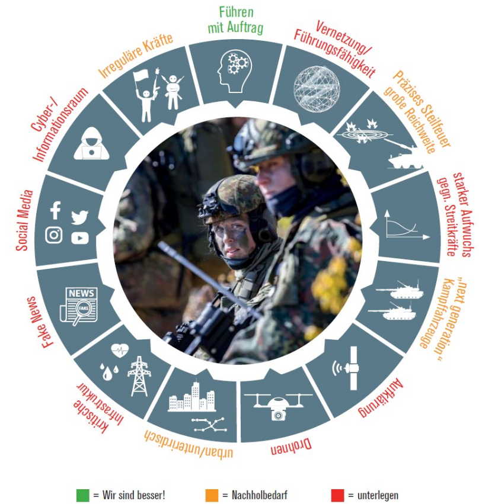
_Grafik die den aktuellen Zustand erläutert_

### Fazit - JW als Königsdisziplin der modernen Kriegführung

- Ab Airland Battle und dem spezifischen Akzent auf offensives Manöver (statt Abnutzung) zur Paralysierung des Gegners wiederholt gefordert
- Multidomain Operations (MDO) als neueste Konzeption der wirkungsraumübergreifenden Kriegführung mit bislang unscharfen Konturen
- Wirksamkeit gegen Hauptbedrohung/-gegner bisher nur wenig erwiesen: tönt einfach, schwierig in Umsetzung
- Stark von amerikanischen Denkern und Technologiegläubigkeit geprägt
- Franz-Stefan Gady: Jede Streitkraft praktiziert heute in irgendeiner Weise diesen Kampf der verbundenen Waffen […] Ich nenne ihn oft die militärische Königsdiziplin. Beherrscht man ihn, kann man die eigenen Verluste niedrig halten und die des Gegner erhöhen.

## Geopolitik und Geostrategie

### Leitfragen

- Wie hat sich die Geopolitik und -strategie als Denkschule etabliert?
- Welche Vertreter haben sie in den letzten Jahren geprägt?
- Welche Prämissen und Limitationen lassen sich aus dieser Denkschule ableiten?

> \[Geography is\] the mother of strategy.  
> \- _C.Gray and G.Sloan in Geopolitics, Geography and Strategy, London 1999_

### Lektüre

- Colin Flint, Introduction to Geopolitics, London 2022 S. 1-20.
- Halford J. Mackinder, The Geographical Pivot of History, in: The Geographical Journal, Vol. XXIII (4), 1904, S. 7-12.

### Heartland Theory

Beginnt mit Rede von Halford J. Mackinder vor der Royal Geographic Society, 25.01.1904: "The Geographical Pivot of History"

- Grundkonflikt: Seemächte gegen Landmächte
  - Vorteil für Landmächte, besonders jene mit Pivot Area = Heartland wegen:
  - Topographie / Geschichte
  - Geographie-Ökonomie
  - Technik / Eisenbahn
- Politische Empfehlungen
  - 1904: Gegenallianz der Seemächte
  - 1919: Pufferzone in Osteuropa

> Who rules East Europe commands the Heartland  
> Who rules the Heartland commands the World-Island  
> Who rules the World-Island commands the World.  
> \- _Halford Mackinder, Democratic Ideals and Reality, New York 1919_

### Rimland-Theorie

Beginnt mit Nicholas Spykman, America’s Strategy in World Politics, New York 1942

> Who controls the rimland rules Eurasia,  
> Who rules Eurasia controls the destinies of the world.  
> \- _The Geography of the Peace, New York 1944_

### Game Plan und das Grand Chessboard

Beginnt mit Zbigniew Brzezinski, Game Plan. A Geostrategic Framework for the Conduct of the US-Soviet Contest, New York 1986

> Whoever controls Eurasia dominates the globe. If the Soviet Union captures the peripheries of this landmass \[…\] it would not only win control of vast human,economic and military resources, but also gain access to the geostrategic approaches to the Western Hemisphere – the Atlantic and the Pacific \[…\]  
> \- _A Geostrategic Framework for the Conduct of the US-Soviet Contest, New York 1986, S. 22-23:_

### Kampf der Kulturen

Beginnt mit Samuel Huntington, The Clash of Civilizations 1993 und The Clash of Civilizations and the Remaking of World Order (1996)

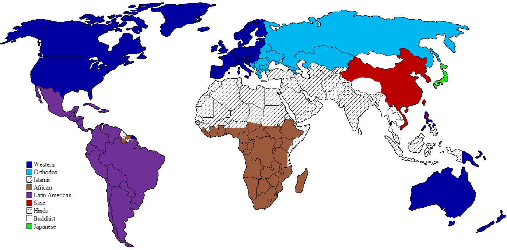
_Einteilung der Welt nach Kulturräumen_

### Geoökonomie und Friend-shoring

Fähigkeit von Regierungen, die wirtschaftliche Stärke ihrer Länder aus bestehenden Finanz- und Handelsbeziehungen zu nutzen, um geopolitische Lattice-like Security Architecture in Asien und wirtschaftliche Ziele zu erreichen.

### Lattice-like Security Architecture in Asien

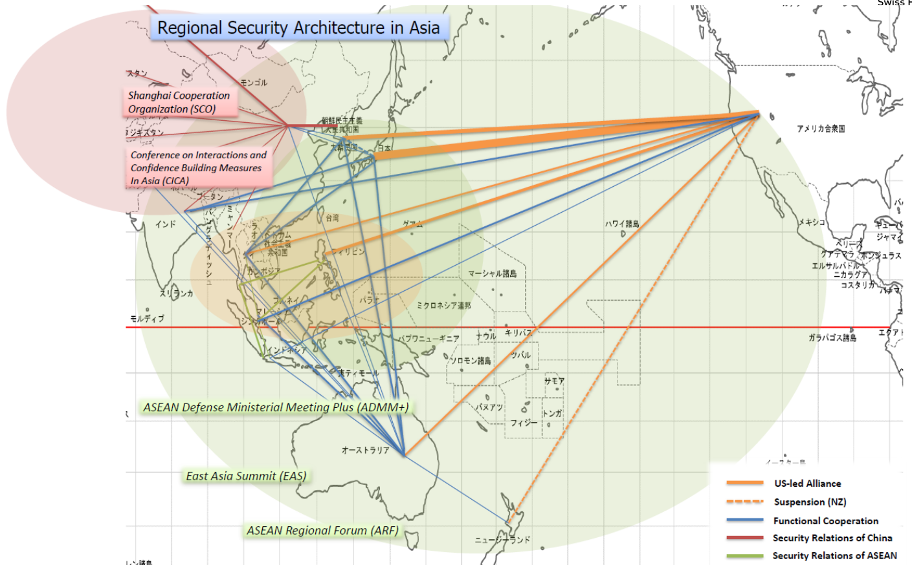
_Hub-and-Spokes Allianzsystem in Asien_

### Fazit

- Eigenständige Theorieschule(n) mit Anspruch auf Erklärung der Gegenwart und auf langfristige Prognosen
- Hoher, interdisziplinärer Anspruch: Verbindung von (Aussen-) Sicherheitspolitik mit Natur- und Geisteswissenschaften (Geografie, Evolutionsbiologie, Geschichte ...)
- Breitenwirkung
- Überbewertung angeblicher "Konstanten"
- Unterschätzung der Irrationalität von Entscheidungsträgern und der technologischen Entwicklung
- Politischer Opportunismus,
- Wissenschaftlichkeit fragwürdig
- Eurasia is thus the chessboard on which the struggle for global primacy continues to be played, and that struggle involves geostrategy. Zbigniew Brzezinski, The Grand Chessboard: American Primacy and Its Geostrategic Imperatives, New York 1997

## Sowjetische Militärstrategie

### Leitfragen

- Welche strategische Kultur galt für das sowjetische Militär?
- Inwiefern fügt sich das Konzept der Tiefen Operation in die sowjetische Militärstrategie ein?
- Welche Elemente der sowjetische Militärstrategie wirken für die aktuelle russische Militärstrategie nach?

### Lektüre

- Hans-Ulrich Seidt, Alexander Swetschin und das strategische Denken Russlands: Ein Beitrag zur Diskussion über Moskaus neue Militärdoktrin, in: Osteuropa, Juli 1994, S. 630- 642.

### Kaiserlich Russische Armee

Konzeptionsstreit im 18. und 19. Jahrhundert, Abnützung oder Zerstörung

- Michail Kutusow (1745-1813): Russland gewinnt Kriege durch Geduld.
- Alexander Suworow (1730- 1800): Russland gewinnt Kriege durch Schnelligkeit.

### Michail Wassiljewitsch Frunse 1885-1925

Zentrale Forderungen an sowjetische Militärstrategie:

- Nächster Krieg langwierig und defensiv
- Operationsraum wegen weitreichender Mittel riesig
- Front und Hinterland organisatorisch vernetzen
- Gesellschaft und Wirtschaft militarisieren
- Wenn nötig, dann direkter Gewalteinsatz (kein indirekter Ansatz)
- Ideologische Beeinflussung

### Rote Armee: Erneuter Konzeptionsstreit 1928/29

- Abnutzung: Alexander Swetschin 1978-1938
- Zerstörung: Wladimir Triandafillow 1987-1931, Michail Tuchatschewski 1893-1937

### Alexander Swetschin und die Operative Stufe

- Staat muss eine Übermobilisierung verhindern
- Deshalb priorisiert Swetschin eine permanente Mobilisierung
- Wirtschaftliches Hinterland muss sicher vor Krieg und Feind sein
- Mischung aus Marxismus (Krieg als Fortsetzung der Politik) und Maoismus (verschiedene Fronten in langem Krieg)

#### Theorie der Operativen Kunst

- Drei militärische Stufen: Strategie, Operationskunst (neu), Taktik
- Definition Operation modern, aber um Planung und Vorbereitung erweitert
- Forderung nach Vorbereitung und Durchführung durch Militärexperten
- Organisation des Rückraums, um Operationen aufrecht zu halten

### Georgii Isserson und die Tiefe Operation

- Von Anfang an offensive Vorgehensweise
- Iteration Manöver – Durchbruch durch Feuerkraft und Masse – Manöver, Vergleich mit Wellen
- Folge: gestaffelte Aufstellung der Verbände, Phasierung
- Riesiger Kräftebedarf
- Unterstützung für Aufrüstungsprogramm Stalins

Mögliches Beispiel **Operation "Bagration"**

### Blitzkrieg vs. Tiefe Operation

<!-- Text Definitions -->

|                       | **Blitzkrieg**                                                                                                                                                                                           | **Tiefe Operation**                                                                                                                                                                                         |
| --------------------- | -------------------------------------------------------------------------------------------------------------------------------------------------------------------------------------------------------- | ----------------------------------------------------------------------------------------------------------------------------------------------------------------------------------------------------------- |
| **Bild**              | _Giftschlange_                                                                                                                                                                   | _Würgeschlange_                                                                                                                                                                    |
| **Durchbruch**        | Schwerpunkt an einer Stelle, schmale Angriffsstreifen                                                                                                                                                    | Mehrere Stellen, breite Front                                                                                                                                                                               |
| **Ziele**             | Schwerpunkt an einer Stelle, schmale Angriffsstreifen, Sukzessive Einkesselung mit kleinen Einheiten, Erweiterung Durchbruchstelle, Vorrücken grosser Verbände, Einkesselung grosser Verbände, Aufrollen | Mehrere Stellen, breite Front, Wirkung gestaffelter Verbände in operative Tiefe, Ausfächern, Abschneiden, Aushungern, weniger Einkesselung von Zentren und Städte, Gegner in strategische Defensive zwingen |
| **Manöver und Feuer** | Bewegung wichtiger als Feuer                                                                                                                                                                             | Feuer wichtiger als Bewegung                                                                                                                                                                                |
| **Akzentsetzung**     | Qualität                                                                                                                                                                                                 | Quantität / Masse                                                                                                                                                                                           |
| **Ausrichtung**       | Offensiv                                                                                                                                                                                                 | Offensiv                                                                                                                                                                                                    |
| **Rolle Luftwaffe**   | Taktisch                                                                                                                                                                                                 | Operativ                                                                                                                                                                                                    |

### Wassili Sokolowski und die Reformen der Tiefen Operation

Änderungen gegenüber Isserson / PU 36:

- Operationsraum maximiert durch neue Waffen
- Einsatz von Raketen à tous azimuts
- Krieg muss in Initialphase entschieden werden
- Konventionelle Streitkräfte zur Landesverteidigung und in regionalen Kriegen
- Bedeutungsverlust von Konzentration, Durchbruch, gestaffelte Aufstellung

### Fazit: Sowjetische Militärstrategie

- Lange strategische Debatte in Russland: Abnützung oder Zerstörung?
- Frunse weist auf Grösse und neue Mittel hin, seine Lösung besteht in einer Militarisierung der Zivilgesellschaft und einer Vernetzung von Front und Hinterland.
- (Erneuter) Richtungsstreit in Roter Armee: Abnützung oder Zerstörung?
- Swetschin priorisiert die Ermattung: Geduld und Abnützung des Gegners.
- Swetschin führt die politikfreie operative Kunst ein: primär defensiv ausgerichtet, Ziel: Gn ausmanövrieren.
- Isserson sucht dagegen die Entscheidungsschlachten und erweitert die schon unter Triandafillow entwickelte Offensivdoktrin der Tiefen Operation.
- Die Tiefe Operation benötigt einen gigantischen Kräftebedarf sowie eine zentrale Planung und Steuerung.
- Sokolowski erweitert die Tiefe Operation qualitativ und geographisch, um im Kalten Krieg als strategische Abschreckung gegenüber der USA zu dienen.

## Reguläre vs. irreguläre Kriegführung

### Leitfragen

- Wie hat sich die Unterscheidung zwischen regulärer und irregulärer Kriegführung entwickelt?
- Inwiefern unterscheidet das heutige Völkerrecht zwischen regulären und irregulären Kombattanten?
- Was besagt das Paradigma der neuen Kriege?

> You know you never defeated us on the battlefield,’ said the American colonel. The North Vietnamese colonel pondered this remark a moment. ‘That may be so,’ he replied, ‘but it is also irrelevant.  
> \- \_Conversation in Hanoi, April 1975, zit. n. Harry G. Summers\_\_

### Lektüre

- Colin S. Gray, Irregular Warfare: One Nature, Many Characters, in: Strategic Studies Quarterly, Vol. 1 (2), 2007), S. 35-57.

### Krieg im Völkerrecht: Ius ad bellum vs. ius in bello

- Ius ad bellum: Das Recht zum Krieg
  - Mit dem Kriegsverbot von 1945 soll die Clausewitz’sche Losung, Der Krieg ist eine blosse Fortsetzung der Politik mit anderen Mitteln, aufgegeben werden.
- Ius in bello: Das Recht im Krieg
  - Humanitäres Völkerrecht oder Kriegsrecht regelt, was im Krieg zulässig ist.

### Regulärer Kombattant

Die Gesetze, die Rechte und die Pflichten sondern auch für die Milizen und Freiwilligen-Korps, wenn sie die folgenden Bedingungen in sich vereinigen:

1. dass jemand an ihrer Spitze steht, der für seine Untergebenen verantwortlich ist,
2. dass sie ein bestimmtes, aus der Ferne, erkennbares Abzeichen tragen,
3. dass sie die Waffen offen führen und
4. dass sie bei ihren Unternehmungen die Gesetze und Gebräuche des Krieges beobachten.

### Irregulärer Kombattant

1. Ist Teil einer politisch nicht rechenschaftspflichtigen Organisation
2. ist äusserlich nicht von der Zivilbevölkerung unterscheidbar
3. trägt Waffen nicht offen
4. missachtet das Kriegsvölkerrecht

### Akademische Datensammlung

- Uppsala Conflict Data Programm UCDP
- Our World in Data OWID

### Debatte um die "neuen Kriege"

Mary Kaldor, New and Old Wars. Organised Violence in a Global Era, Cambridge 2012 (3. Auflage)

- Seit dem Ende des 20. Jahrhunderts gibt es einen neuen Kriegstypus: der neue Krieg
- Darin verschmelzen Krieg, organisierte Kriminalität und kollektive Menschen- rechtsverletzungen
- Neue Kriege sind privatisiert und informell
- Globalisierung, Technologie und transna- tionaler Austausch in den Bereichen Politik, Ökonomie, Militär und Kultur fördern Neue Kriege
- Soziale (nicht technologische) Revolution in military affairs
- Staatliches Gewaltmonopol für Kriege erodiert
- Ziel der neuen Kriege liegt in Identitätspoli- tik, nicht länger geopolitische oder ideolo- gische Ziele
- Fear and hatred, statt hearts and minds

### Begriffsdefinition

- **Krieg** Anwendung organisierter bewaffneter Gewalt zwischen menschlichen Kollektiven zur Durchsetzung von Interessen und mit Folge von Todesopfern und physischen Schäden
- **Regulärer Krieg** meint den Krieg zwischen zwei (oder mehr) Staaten.
- **Irregulärer Krieg** meint den Krieg zwischen einem (oder mehreren) Staaten einerseits und einer (oder mehrerer) nicht-staatlicher Gruppierungen andererseits.

### Spezialfall hybrider Krieg, hybride Bedrohung

> Hybrid wars incorporate a range of different modes of warfare, including conventional capabilities, irregular tactics and formations, terrorist acts including indiscriminate violence and coercion, and criminal disorder.  
> \- _Frank G. Hoffman, Conflict in the 21st Century: the Rise of Hybrid Wars, Arlington 2007_

> I define a hybrid threat as: Any adversary that simultaneously and adaptively employs a fused mix of conventional weapons, irregular tactics, terrorism and criminal behavior in the battle space to obtain their political objectives.  
> \- _Frank G. Hoffman, Hybrid vs. Compound War, Armed Forces_

### Fazit

- Der Krieg ist völkerrechtlich geächtet. Das moderne Völkerrecht spricht nur noch von bewaffnetem Konflikt.
- Krieg ist nur noch ein politischer Begriff und als solcher nicht normiert; alle Abgrenzungen zum Nicht-Krieg sind willkürlich. Auch das allgemeine Verständnis hat unscharfe Konturen.
- Krieg ist ein hochkomplexes, dynamisches Phänomen, dass sich nicht mit einfachen Formeln (alt/neu, (un)konventionell, (a)symmetrisch, (ir)regulär, hybrid etc.) kategorisieren lässt.
- Regulärer Krieg meint den Krieg zwischen
- Wir unterscheiden einzig zwischen regulärem/irregulärem Krieg.
- Im Krieg dominiert die Asymmetrie, auch weil sie von den Kriegsparteien aktiv angestrebt wird. Symmetrien sind allenfalls punktuell und temporär

## Aufstandstheorien

### Leitfragen

- Welche strategischen Grundsätze verfolgen irreguläre Kämpfer?
- Weshalb waren gewisse Aufstandsbewegungen erfolgreich?
- Welche Rolle spielt die Zivilbevölkerung während Aufständen?

### Lektüre

- Seth G. Jones/Patrick B. Johnston, The Future of Insurgency, in: Studies in Conflict & Terrorism, Vol. 36 (1), 2013, S. 1-25.

### Aufstand als Konstante der Strategiegeschichte

- Amerikanischer Unabhängigkeitskrieg
- Guerilla in Spanien
- Clausewitz (Vom Kriege, 6. Buch, 26. Kapitel, Volksbewaffnung)
  - dass der Krieg im Innern des Landes geführt
  - dass er nicht durch eine einzige Katastrophe entschieden werde
  - dass das Kriegstheater eine beträchtliche Länderstrecke einnehme
  - dass der Volkscharakter die Massregel unterstütze
  - dass das Land sehr durchschnitten und unzugänglich sei, entweder durch Gebirge oder durch Wälder und Sümpfe oder durch die Natur der Bodenkultur

### Generelle Aufstandsstrategie

- Keine Suche nach Entscheidungsschlacht, stattdessen Überdehnung Gegner
- Hohe Kosten für Gegner (materiell, aber auch politische Legitimität) provozieren
- Unterstützung durch Bevölkerung entscheidend (aktive Minderheit und passive Mehrheit)
- Schrittweiser Übergang zu direkterer Konfrontation mit Gegner mit zunehmender Macht und Gebietskontrolle

### Kategorien des Aufstands

|                                                                                | ethnisch-nationalistisch motivierter Aufstand                                                                                        | sozialrevolutionärer Aufstand                                                                                                                     | Islamistischer "Aufstand"                                                                                                                                      |
| ------------------------------------------------------------------------------ | ------------------------------------------------------------------------------------------------------------------------------------ | ------------------------------------------------------------------------------------------------------------------------------------------------- | -------------------------------------------------------------------------------------------------------------------------------------------------------------- |
| Selbstbezeichnung der Insurgenten                                              | Guerillero, Partisan, Résistance- bzw. Freiheitskämpfer                                                                              | Revolutionär, Guerillero                                                                                                                          | Mudschahid ("Gotteskrieger")                                                                                                                                   |
| Strategisches Ziel bzw. politische Legitimation der Insurgenten                | Abschütteln Fremdherrschaft, Machtübernahme (daher Aufbau regulärer Streitkräfte)                                                    | Sturz "ungerechte", reaktionäre Herrschaft, Machtübernahme (daher Aufbau reg. Streitkräfte)                                                       | Zurückdrängung west. Einfluss in islamischer Welt, Sturz säkularer Regimes, islamische Herrschaft (lokal/regional bis global (AQ, IS))                         |
| Taktisch-operative Primär-Ziele der Insurgenten                                | Gegnerische Sicherheitskräfte: Beeinflussung Kosten-Nutzen-Rechnung des Gegners, Ermattung Gegner. Anfänglich defensive Kriegführung | Gegnerische Sicherheitskräfte: Zerschlagung gegnerisches Potenzial (in Raten). Anfänglich defensive Kriegführung                                  | Gegnerische Sicherheitskräfte, Zivilbevölkerung                                                                                                                |
| "Exit-Option" für den Gegner?                                                  | Ja (Exil, Rückzug)                                                                                                                   | Nein (da "Volksfeind")                                                                                                                            | Unterschiedlich (nicht für Juden)                                                                                                                              |
| Rekrutierung und Finanzierung, operative Steuerung                             | national, zentral                                                                                                                    | transnational-global, zentral                                                                                                                     | transnational-global, dezentral                                                                                                                                |
| Adressat der Insurgenten (der über Mediatisierung "zu interessierende Dritte") | eigene Nation                                                                                                                        | Bürger ("tier état"), internationale Arbeiterklasse ("Proletariat")                                                                               | Islamische Gemeinschaft ("Ummah")                                                                                                                              |
| Mittel                                                                         | Nutzung eigener Zivilbevölkerung als logistische Basis, Bündnis mit ausländischer Armee möglich                                      | Nutzung der Infrastruktur des Gegners, Bündnis mit ausl. Armee möglich                                                                            | Nutzung der Infrastruktur des Gegners, eigene Bevölkerung, Kooperation/Allianzen möglich                                                                       |
| Waffeneinsatz                                                                  | konventionell, beschränkt (low tech)                                                                                                 | konventionell, beschränkt (low tech)                                                                                                              | konv. (low tech – high tech (Hisbollah), ABC (angestrebt)                                                                                                      |
| Hauptschauplätze                                                               | Spanischer Aufstand gegen Napoleon (1807- 14), Aufstände in Kolonien (ab 1914), Widerstand (1940-45), Indochina/Vietnam (1963-73)    | Franz. Revolution (1789), Liberale Rev. in Deutschland (1848/49), Pariser Kommune (1871), chines. Bürgerkrieg (1928-36, 1945- 49), Kuba (1956-58) | Afghanistan, Libanon (ab 1980er Jahre), Israel/PA-Gebiete (ab 1988); Algerien (ab 1990er Jahre), Irak, Syrien, Jemen, Somalia, Nigeria, Mali, Südostasien usw. |
| Theoretische Grundlagen (z.B.)                                                 | T.E. Lawrence (of Arabia), Giap, von Dach                                                                                            | Engels, Lenin, Trotzki, Mao Tse-tung, Che Guevara, Marighella, Giap                                                                               | Qutb, Fadlallah, Azzam, al-Suri, Naji                                                                                                                          |

### Aufstandsmodelle

#### Maoistisches Modell

- Phase I: Klandestine Agitation, Propaganda, Indoktrinierung
- Phase II: Expansion durch irreguläre Kriegführung
- Phase III: Zerstörung durch konventionelle Konfrontation

#### Foco

- Durchführung militärischer Aktionen durch Avantgarde (Foco)
- Zustrom durch Landbevölkerung
- Sukzessive Ausdehnung durch neue Focos

#### Algerische Front de Libération Nationale (FLN)

- Maostisches Modell in Kombination mit Terrorismus im urbanen Raum
- Überreaktion der Sicherheitskräfte
- führt zu Unterminierung Aufstandsbekämpfung

#### Provisional Irish Republican Army (PIRA)

- Simultane Nutzung von Gewaltanwendung, zivilem Ungehorsam (Streiks, Demonstrationen, Sitzblockaden, Hungerstreiks), politische Partizipation

### Friedrich Engels 1820-1895

#### Der Aufstand als Kunst 1852

- Ausgleich Nachteile (Organisation, Disziplin, Autorität) vor Eröffnung des Kampfes
- Entschlossenheit bei Eröffnung des Kampfes
- Nachhaltige offensive Kampfführung (Momentum)
- Gewinnung Unentschlossener

#### Die Kriegsführung des Proletariats 1852

- Neue Kriegsmethode: Emanzipiertes Proletariat nutzt (militär-)technische Errungenschaften
- Revolutionäre Truppe wird in konventionelle Massenarmee umgewandelt

### Mao Tse-tung 1893-1976

#### Ein Funke kann die ganze Steppe in Brand setzen 1930

- Elastizität (Konzentration, Dispersion)
- "Kreiseziehen": Agitation in der Bevölkerung

#### Guerrilla Warfare 1937

- subsidiär in langem Krieg (Feind technisch überlegen, aber ausgedünnt)
- Selbsterhaltung (= Grund-Axiom) und Wachstum
- Elastizität (s.o.), Offensive/Defensive/Verzögerung
- Basen/Operationen im feindbesetzten Gebiet (äussere Linien)

#### Militärischen Prinzipien zum Sieg über Chiang Kai-shek 1947

- Konzentration (Schaffung punktueller Überlegenheit) gegen Opportunitätsziele, Vernichtung
- Dispersion gegenüber feindlicher Überlegenheit
- Wachstum durch Überläufer, Stärkung durch Beute

Voraussetzungen:
Vorbereitung, Mut, Opfersinn, Ausdauer, Beweglichkeit, Erholung.

### Hans von Dach 1926-2002

Der totale Widerstand: Kleinkriegsanleitung für jedermann, Bern 1957

- Grundszenario: CH Nebenschauplatz von Gegner, dessen Kräfte an vielen Fronten gebunden, CH-Volksaufstand Teil breiterer Erhebung.
- Volksaufstand: unvermeidlich, machbar, legitim/moralisch/ehrenvoll, stärkt Verhandlungsposition in Nachkriegszeit.
- Widerstandsorganisation: Beitrag zur Kriegsverhinderung (Abschreckung), Verlängerung des Krieges, Schädigung des Besatzers, Fernziel: allgemeiner offener Aufstand.
- Beziehung zur regulären Armee: "Auffangorganisation" für versprengte Kader/Mannschaften und Milizorganisationen, Anknüpfung an Grundausbildung Armee und Taktiken Jagdkampf, Ergänzung um technische und taktische Anleitung für Kleinkrieg.

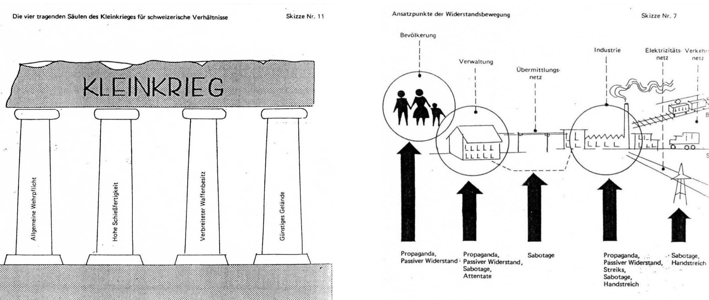
_Skizzen zur Kleinkriegsanleitung_

### Ernesto (Che) Guevara (1928-1967)

Beginn, Entwicklung und Ende des Guerillakrieges, Berlin 1968

- Etappe 1: Bestehen einer (isolierten) Avantgarde (= "Foco")
- Etappe 2: Einzeloperationen des Foco: Zustrom von Landbewohnern; grössere Bewegungsfreiheit
- Etappe 3: Provisorische werden zu festen Einrichtungen, Guerilla-Industrie
- Etappe 4: Erbeutung von Waffen, (Proto-)Regierung/Verwaltung, Gesetze, Schulung/Propaganda
- Etappe 5: Weitere Foco-Ableger bis in Vorstädte
- Etappe 6: Sabotage, Terror in "ungünstigen" (= städtischen) Gebieten
- Etappe 7: Guerilla mutiert zu regulärer Armee: Gegner kapituliert

Kontinuierliche Ausweitung der Operationsraums durch Bildung immer neuer "Focos" und Verschmelzung mit dem Volk.

### Suizidattentat: Innovation und Wissensdiffusion

- Erste, gezielte Anwendungen durch Hisbollah zu Beginn 1980er Jahre
- Verbreitung durch Inspiration/Imitation oder Kooperation/Ausbildung
- Spektrum: linksnationalistische – radikalislamistische Gruppierungen; grösster Anteil: Globale Dschihad-Bewegung

### Externe Unterstützung als potenzieller Erfolgsfaktor

- Formen externer Unterstützung
  - Sicherer Zufluchtsort
  - Finanzielle Mittel und Kriegsmaterial
  - Ausbildung
  - ND-Erkenntnisse, Planung von Operationen
  - Unterstützendes Feuer
- Verbesserte militärische Fähigkeiten, Ressourcenzuwachs, politische Anerkennung auf internationaler Ebene
- Grosser Nutzen, aber auch potenziell signifikante Kosten und Risiken

### Fazit

- Keine direkte Konfrontation mit militärisch überlegenem Gegner, stattdessen Überdehnung und Kampf um politische Kontrolle und Legitimität
- Kombination von politischer Subversion und militärischen Aktionen, zunehmende Gebietskontrolle erlaubt Ausbau militärischer Fähigkeiten sowie Macht und Einfluss durch de-facto Regierung

1. Sozialrevolutionärer Aufstand als zentrale Referenz für sozialistischen Klassenkampf (bis Ende Kalter Krieg): Engels für Revolutionen in (industrialisiertem) Europa; Mao und Che für Revolutionen in (agrarischer) südlicher Hemisphäre

- Engels: Organisation, Entschlossenheit, Momentum
- Mao: Drei Phasen des Volkskrieges, seriell:
  - Defensive: Aufbau Organisation, Rekrutierung
  - Gleichgewicht: begrenzte Angriffe aus sicherem Gebiet
  - Offensive: mit disziplinierter, regulärer Armee
  - Kampf primär politisch (Analyse Beziehung Partisanen-Volk)
- Che: Gewalt durch Avantgarde transformiert politische Situation, Proliferation von Focos

2. Ethnisch-nationalistischer Aufstand

- von Dach:
  Umfassender Aufstandstheorie
  Rückgriff auf Besonderheiten der Schweiz
  Idealisierung der Opferbereitschaft
  Unterschätzung Risiken/Missbrauchspotenzial

3. Islamistischer Aufstand: Suizidattentat und Terrorismus

- Problem: Diskrepanz Theorie (Propaganda) – Realität (Umsetzung)

## Aufstandsbekämpfungstheorien

### Leitfragen

- Welche strategischen Grundsätze verfolgen organisierte Streitkräfte bei der Bekämpfung
  von Aufständischen?
- Weshalb waren gewisse reguläre Armeen erfolgreich in der Niederschlagung von
  Aufständen?
- Welche Rolle spielt die Zivilbevölkerung?

### Lektüre

- David H. Petraeus, Learning Counterinsurgency: Observations from Soldiering in Iraq, in: Military Review, January-February 2006, S. 45-55.
- Gian P. Gentile, A Requiem for American Counterinsurgency, in: Orbis, Vol. 57 (4), 2013, S. 549-558.

### Grundkonstellation Aufstandsbekämpfung

- Lokale Aufständische vs. externe Besatzungsmacht
- Aufständische kämpfen zumeist irregulär und zwingen damit die Besatzungsmacht in langwierige Pazifizierungs- und Stabilisierungsoperationen fernab der Heimat
- Aus der Perspektive der Besatzungsmächte wird deshalb von "kleinen" Kriegen (small wars, petites guerres) mit niedriger Intensität gesprochen.
- Die Aufstandsbekämpfungstheorien versuchen, eine Doktrin zum Sieg in irregulären Kriegen zu formulieren
- Simplifizierendes Kontinuum: population centric approach <---> kinetic approach

> Comprehensive civilian and military efforts designed to simultaneously defeat and contain insurgency and address its root causes.  
> \- Definition COIN nach JP 1-02, S. 53

### Aufstandsbekämpfung mit harter Hand

- Charles E. Callwell 1859-1928
  - Lessons to Be Learned from the Campaigns in Which British Forces Have Been Employed, 1887
  - Small Wars: Their Principles and Practice, 1896-1906

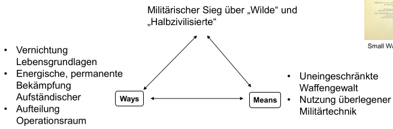
_Schematische Einordnung von Callwells Ansatz_

### Imperial Policing

- Charles W.Gwynn 1870-1962
  - Imperial Policing 1934

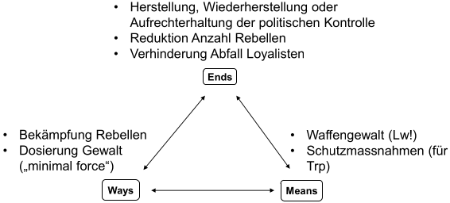

### Malayan Emergency (1948-1960)

- Emergency Regulations 1948, Briggs-Plan 1950
- Umsiedlungen (new villages), Kollektivstrafen, Terror, Exekutionen
- Rural Industrial Development
- Multiethnische zivil-militärische Verwaltung
- Aufbau multiethnische malaiische Armee/Polizei

### Algerienkrieg (1954-1962)

Front de Libération Nationale (FLN) vs.
Französische Armee & Pieds-noirs & Loyalisten

### Die französische Doktrin

- Roger Trinquier 1908-1986
- David Galula (1919-1967)
- Französische Indochina-Veteranen schlussfolgern, dass es nach der Niederlage bei Dien Bien Phu (1954) eine neue Doktrin brauche.
- Statt dem totalen Krieg drohe die kommunistische Subversion/Revolution.

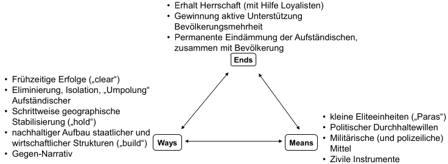
_Schematische Einordnung des französischen Ansatzes_

### Technologie und COIN in Vietnam 1965-1975

- Luftaufklärung? (links,o)
- Agent Orange (links,u)
- Schnüffelgerät (mitte,o)
- Abholzung (mitte,u)
- Versorgung durch **Ho-Chi-Minh-Pfad** (rechts)

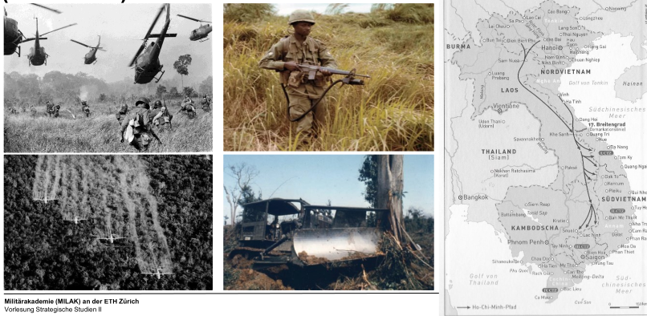

### Aufstandsbekämpfung im Kalten Krieg

- Referenzwerke für moderne COIN-Theorien
- Zunehmend konstruktiver Einbezug lokale Bevölkerung
- Erkenntnis, dass konventionelle Kriegführung gegen irregulären Gegner nicht erfolgversprechend ist
- Erkenntnis, dass Erfolg der Guerilla bei externer, konventioneller Unterstützung steigt
- Häufig: Unterschätzung des Gegners

### COIN: US-Zwischenbilanz 2006

- FM 3-24: "The People-centric Approach"
- Einsätze in 4 Phasen: 1. Shape 2. Clear 3. Hold 4. Build

### Fazit und Kritik: Das Ende von Coin?

- COIN-Erfahrungen häufig selektiv und idealisiert
- COIN-Erfolg abhängig von Verhältnissen im Zielland: Regierung muss Legitimität bei Zivilbevölkerung primär selbst schaffen
- Streitkräfte wenig geeignet für "build"-Komponenten von COIN
- Vorwürfe an moderne COIN-Konzeptionen:
  - COIN unterstütze westliche politische Agenden der Expansion (verdeckter Imperialismus)
  - COIN schwäche Fähigkeit von Streitkräften zur konventionellen Kriegführung (Kernkompetenz)
  - COIN zu kostspielig und von fragwürdiger Nachhaltigkeit
- Erfolgsbilanz derzeit nicht besonders gut, politischer Wille für COIN tief
- Trotzdem bleibt irreguläre Kriegführung sowie Aufstandsbekämpfung auch im Schatten des derzeitigen Grossmachtwettbewerbs relevant

## Die strategische Bedeutung von Kriegsgefangenen

mit Dr. Tamara Cubito

### Leitfragen

- Welche strategische Bedeutung kommt Kriegsgefangenen in regulären und irregulären
  Konstellationen zu?
- Wie müssen Kriegsgefangene nach dem Völkerrecht behandelt werden?
- Welche Rolle kommt dem IKRK zu?

> What is a prisoner of war? He is a man who tries to kill you and fails, and then asks you, not to kill him.  
> \- _Winston Churchill (zugeschrieben)_

### Lektüre

- Sibylle Scheipers, Introduction: Prisoners in War, in: Sibylle Scheipers (Hg.), Prisoners in War, New York 2010, S. 1-3, 7-16.
- Sibylle Scheipers, Conclusion: Prisoners and Detainees in Current and Future Military Operations, in: Sibylle Scheipers (Hg.), Prisoners in War, New York 2010, S. 313-318.

### Mannigfaltige Bedeutungen

- Je nach Konfliktlogik und -parteien kommen Kriegsgefangenen ganz unterschiedliche Bedeutungen zu

- Die neuere Forschung sieht Kriegsgefangene nicht länger "nur" als Opfer, sondern zunehmend als Akteure, Ressourcen und Spiegel der Ideologie(n)

### Bis zum 19. Jahrhundert

- "Range" an Optionen: Exekution, Versklavung, Gefangenschaft, Freilassung, Freikauf, Austausch, Parole, Eingliederung in die eigenen Streitkräfte
- Gebräuche und Abmachungen, keine verbindlichen Gesetze und Regeln
- Kaum Kriegsgefangenenlager
- Wichtig: Unterschiede Offiziere-Soldaten
- ab 19. Jahrhundert: Beginn "moderner" Kriegsgefangenschaft

### Erste internationale Abkommen

#### General Orders No. 100 (1863)

- Regelungen im US Civil War von Francis Lieber (1800-1872)

> A prisoner of war is subject to no punishment for being a public enemy, nor is any revenge wreaked upon him by the intentional infliction of any suffering, or disgrace, by cruel imprisonment, want of food, by mutilation, death, or any other barbarity.  
> _General Orders No. 100, Artikel 56_

- 157 Artikel untersagen als Vorläufer der Genfer Konvention Folter und unmenschliche Behandlung
- Kriegsgefangenschaft als Schutz-, nicht Strafmassnahme
- Definition der Freilassungs- oder Austauschregelungen

#### Wichtiger Wendepunkt: 1870/71

- Bis dahin unvorstellbare Anzahl POWs (Bis Ende 1870: über 340’000 frz. POWs)
- Preussischer Generalstabschef von Moltke bestand auf Gefangenschaft: Entzug Kampfkraft
- Regulativ über die Behandlung, Verpflegung der Kriegsgefangenen nach erfolgtem Eintreffen in den Gefangenendepots
- Sold, Kost und Logis
- Sonderbehandlung von Offizieren (z.B.Ehrenwort, Unterkunft, Bezahlung)
- Erstmalige Lagerbesuche und Involvierung internationaler Organisationen, z.B. IKRK
- Unklarheiten bei Kriegsgefangenenstatus von Franc-Tireurs
- Konklusion: Es braucht ein internationales Abkommen!

#### Haager Landkriegsordnung

Haager Friedenskonferenzen 1899 & 1907 in Den Haag

- Aufklärerische und pazifistische Akteure wollen den Krieg einschränken und/oder "humanisieren"
- Vage Definitionen zu Kombattanten und Kriegsgefangenen
- Grundsatz: Unbedingte Verschonung sich ergebender Gegner und deren angemessene Behandlung
- Artikel 4: "Die Kriegsgefangenen unterstehen der Gewalt der feindlichen Regierung, aber nicht der Gewalt der Personen oder der Korps, die sie gefangengenommen haben. Sie sollen mit Menschlichkeit behandelt werden. Alles, was ihnen persönlich gehört, verbleibt ihr Eigentum mit Ausnahme von Waffen, Pferden und Schriftstücken militärischen Inhalts."

### Erster Weltkrieg

#### Ein paar Zahlen

- Insgesamt: 6,6-8,4 Mio. Kriegsgefangene an allen Fronten
  (ca. 1 von 8 Soldaten)
- Grosse Unterschiede nach Kriegsschauplätzen/Nationen (z.B. Österreich-Ungarn: 1 von 3)

#### Probleme in der Praxis

- Ab wann ein POW?

  > We were held up by machine-gun fire from a ridge… I don’t know how I escaped because I was lying right out in the front. After losing half of my company there, we rushed them and they had the nerve to throw up their hands and cry, "Kamerad" All the "Kamerad" they got was a foot of cold steel thro them from my remaining men while I blew their brains out with my revolver without any hesitation. You may think this rather rough but if you had seen my boys go down you would have done the same and my only regret is that too many prisoners are taken.  
  > _Lieutenant R.C. Germain, 20th Canadian Infantry Battalion_

#### Propaganda

- Einsatz zum motivieren der eigenen und demotivieren der gegnerischen Armee und Bevölkerung.

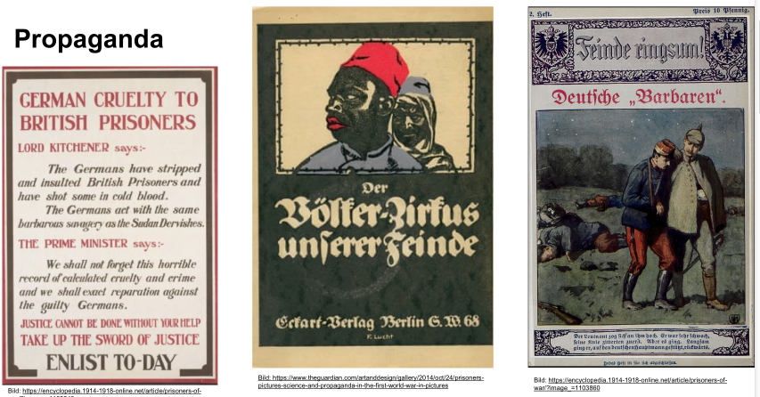
_CAPTION_

#### Politische Instrumente

- Reziprozität: Bessere Bedingungen für eigene Kriegsgefangene
- Möglichst viele Kriegsgefangene ein Vorteil
- Aber: Funktioniert nur, wenn ein Staat am Wohlergehen seiner Kriegsgefangenen interessiert ist (Bsp. Italien)
- Druckmittel für Unterzeichnung des Friedensabkommens nach Kriegsende

#### Zeichen des militärischen Erfolgs

- Wie wird Erfolg gemessen?
- Grabenkrieg: Kriegsgefangene als Beweis für Erfolg an einer Front ohne grosse Gebietsgewinne
- ?Motivation?

#### Arbeitskräfte

- Arbeit explizit erlaubt
- DR: 2,5 Mio. Kriegsgefangene bis Kriegsende; 90% davon als Arbeitskräfte eingesetzt (hauptsächlich Landwirtschaft und Industrie inkl. Munitionsproduktion)
- 1918: 18% aller Kohlearbeiter im Ruhrgebiet Kriegsgefangene
- Trotz Verbot: Hunderttausende Kriegsgefangene an Front eingesetzt, z.B. Grabenbau
- Nach Kriegsende: Für Wiederaufbau eingesetzt

### Genfer Konventionen

#### Erstes Abkommen 1929

- Abkommen über die Behandlung von Kriegsgefangenen
- Bis dato umfassendste Kodifikation des Kriegsgefangenenrechts
- Völkerrechtliche Akzeptanz des IKRK

#### Anpassung 1949

- Völkerrechtliche Zäsur durch Genfer Konvention 1949
- Ersetzt das 1929er Abkommen

#### Dritte Konvention 19??

- Konvention bezüglich der Behandlung von Kriegsgefangenen
- Verbietet insbesondere Tötung, Gefährdung, Gewaltanwendung, Folter, Verstümmelung, Experimente, Bedrohung, Beleidigung, Erniedrigung, öffentliches Zurschaustellen, Repressalien sowie Vergeltungsmassnahmen

### Zweiter Weltkrieg

#### Kriegsgefangene 1937-1945

- Insgesamt mind. 35 Mio. Kriegsgefangene
- Je nach Kriegsphase ungleiche Gefangenenzahlen
- Bsp. Barbarossa: 30’000 deutsche POWs vs. 3,35 Mio. sowjetische POWs innert 6 Monaten)
- Extreme Unterschiede je nach Kriegsschauplatz; entsprechend auch unterschiedliche strategische Bedeutung
- Relevanz "rassistischer" Elemente für die Kriegsgefangenschaft, z.B. chinesische POWs
- Hohe Todesraten: Von 9 Mio. POWs an Ostfront verstarben bspw. 4 Mio. in Gefangenschaft
- Mehr Durchhaltewillen aufgrund von Angst vor Kriegsgefangenschaft?

#### Probleme in der Praxis

- Wer ist ein Kriegsgefangener?
- Kolonialtruppen oder Freie Franzosen von Deutschen nicht als reguläre Soldaten anerkannt
- Handelsmarine: POWs für die Deutschen, Zivilisten für die Briten
- Was passiert mit POWs nach "Seitenwechsel"? (Bsp.: Italien 1943)
- Drittes Reich: Einzelne sowjetische Soldaten oder kleine Gruppen = Partisanen

#### Arbeitskräfte

- Deutsche und Italiener in Landwirtschaft, Bauindustrie (zivil) und Forstwirtschaft in GB
- Italienische POWs bauten Strassen und halfen in der südafrikanischen Landwirtschaft
- Australier, Briten und Inder für den Bau einer Eisenbahnlinie in Burma/Thailand
- Oft je nach Verlauf des Krieges; z.B. Italienische POWs der USA in Nordafrika zuerst vor Ort eingesetzt (z.B. Transport, Strassenbau) und nach Ende der Kampagne in den USA

##### Beispiel Drittes Reich

- Ab 1939: Polnische POWs (Sommer 1940: ca. 400’000), dann "Statuswechsel"
- Frankreich: POWs ausgetauscht, "Statuswechsel" oder gem. Genfer Konventionen als POWs
- Ab 1941: Sowjetische POWs
- Ab 1943: 600’000 italienische "Verräter"

#### Rekrutierungspool

- Bsp. Polnische POWs der Sowjets (2 Korpus Polski)
- Bsp. Drittes Reich:
  - Ab Juli 1941: Selektionierte sowjetische Hiwis in Wehrmacht als Ersatz
  - "Osttruppen" teils in Wehrmacht integriert, teils separate Einheiten
  - Verschiedenste Rollen, insgesamt 1-1,3 Mio.
- Bsp. Japan: INA

#### Objekte der Indoktrination

Indoktrination und Politische Instrumentalisierung

- Gescheiterte sowjetische Indoktrination polnischer Offiziere: Massaker von Katyn
- Entnazifizierung in den USA und Grossbritannien
  - Mit Facts, Filmen, Zeitungen, Vorträgen etc. überzeugen
  - "Nazi"-Literatur aus Lagern entfernt und ersetzt mit "verbotenen" Büchern
  - Trennung von Gefangenen, Unterstützung von "anti-Nazi" POWs
- Bedeutung von POWs in der "Flamenpolitik" des Dritten Reichs
- Sowjetunion: Indoktrination zweitrangig

#### Propaganda

- "Positive" Propaganda weniger bedeutend als im Ersten Weltkrieg
- Beispiel Japan: Weisse POWs, um japanische Überlegenheit zu "beweisen"

#### Nach dem Krieg

• Kriegsgefangene in grösserem Ausmass als 1914-18 für Wiederaufbau und Arbeiten nach
Kriegsende eingesetzt
• Nicht mehr POWs, sondern "surrendered military personnel"
• Wurden von Alliierten in Europa "verteilt"
• Japanische ex-Soldaten in aufflammenden Kriegen in Kolonien eingesetzt

#### Fazit Zweiter Weltkrieg

Jegliche Abkommen betreffend Kriegsgefangener nutzlos?

### Wer ist Kriegsgefangener?

Gemäss **Genfer Abkommen** über die Behandlung der Kriegsgefangenen,

**Artikel 4**: Kriegsgefangene im Sinne des vorliegenden Abkommens sind die in die Gewalt des Feindes gefallenen Personen, die einer der nachstehenden Kategorien angehören:

- Angehörige von bewaffneten Kräften einer am Konflikt beteiligten Partei, ebenso Angehörige von Milizen und Freiwilligenkorps, die zu diesen bewaffneten Kräften gehören
- Angehörige anderer Milizen und Freiwilligenkorps, einschliesslich solcher von organisierten Widerstandsbewegungen, die zu einer am Konflikt beteiligten Partei gehören und ausserhalb oder innerhalb ihres eigenen Gebietes, auch wenn dasselbe besetzt ist, tätig sind, sofern diese Milizen oder Freiwilligenkorps, einschliesslich der organisierten Widerstandsbewegungen:
  - an ihrer Spitze eine für ihre Untergebenen verantwortliche Person haben
  - ein bleibendes und von weitem erkennbares Zeichen tragen
  - die Waffen offen tragen
  - bei ihren Operationen die Gesetze und Gebräuche des Krieges einhalten
- Angehörige regulärer bewaffneter Kräfte, die sich zu einer von der Gewahrsamsmacht nicht anerkannten Regierung oder Behörde bekennen
- Personen, die den bewaffneten Kräften folgen […]
- Besatzungsmitglieder der Handelsmarine […]
- die Bevölkerung eines unbesetzten Gebietes, die beim Herannahen des Feindes aus eigenem Antrieb die Waffen gegen die Invasionstruppen ergreift, ohne zur Bildung regulärer Streitkräfte Zeit gehabt zu haben, sofern sie die Waffen offen trägt und die Gesetze und Gebräuche des Krieges einhält." […]

#### Info

Auch irreguläre Kombattanten müssen als POWs behandelt werden, bis ihnen ein Kriegsgericht den
Kriegsgefangenenstatus abspricht!

### POWs als Quelle für Informationen

- POWs müssen lediglich
  - Name,
  - Dienstgrad,
  - Geburtsdatum
  - und Erkennungsnummer preisgeben
- Alles Weitere dürfen sie verweigern
- Verhöre sind erlaubt, dürfen aber nicht zu physischen oder psychologischen Schäden führen
- Befragung durch militärisch geschultes Personal:
  - Vertauensaufbau, Aushorchung, psychologische Techniken
- Verbot von Bestrafungen

### POWs in der Schweizer Armee

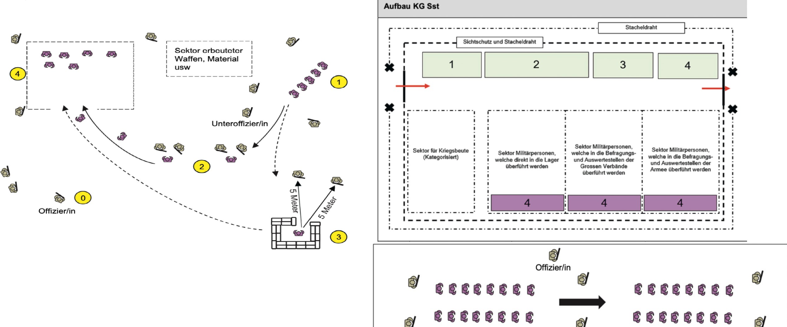
_Kdo Op, FGG1, Reglement Kriegsgefangenen- und Interniertenwesen, Bern, 2024, S.21,26_

### Fazit

- Reglementierung und Systematisierung des POW-Status, der Rechte und Pflichten mit sich bringt
- Problematik der Abgrenzung POWs vs zivile Gefangene
- Mannigfaltige strategische Bedeutungen von Kriegsgefangenen: Vom Informationsträger über die politische und diplomatische Symbolik bis zur Verhandlungsmasse
- Über die Behandlung von Gefangenen lernen wir viel über die strategische Kultur einer Streitkraft / eines Landes

## Kriegslogistik

mit Dr. Ronald Ti

### Leitfragen

- Wie hat sich die moderne Kriegslogistik entwickelt?
- Wie interagieren militärstrategische Prinzipien mit der Kriegslogistik?
- Welche Rolle spielt die Kriegslogistik im Ukrainekrieg?

### Lektüre

- Ronald Ti/Christopher Kinsey, Lessons from the Russo-Ukrainian Conflict: The Primacy of Logistics over Strategy, in: Defence Studies, Vol. 23 (3), 2023, S. 381-398.

### Ziel der Gastvorlesung

- Einführung in die logistische Planung von Expeditionen in einem Joint Force Hauptquartier
- Besprechung von Kontingenzoperationen / Non-Article V Crisis Response Operations (NA5CRO’s) aber **nicht** stationäre Operationen wie UNIFIL/ UNDOF.

  
  _Be the swan..._ **?**

### 5 D der Logistik

#### Destination - Zielort

- Standplatz, Infrastruktur
  - Humanitarian Assistance Disaster Relief (HADR) Operationen häufig in kurz zuvor umkämpften Regionen
  - Gute Infrastruktur ist rar
  - Benötigt Militäringenieure zum Aufbau
  - Benötigt Militäringenieure zum Räumen von explosiven Überresten
- Air Point of Disembarktion (APOD)
  - Landebahn oder Flugplatz
  - Logistischer Fluss nicht nur durch verfügbare Flugzeuge vorgegeben
  - Benötigt Säuberung von Blindgängern und Minen
  - Benötigt Unterhalt und Reperaturen
- Sea Point of Disembarkation (SPOD)
  - Muss von Minen gesäubert sein
  - Kann blockiert sein und muss ausgebaggert werden
  - Hafeninfrastruktur zerstört
- Beach
  - Gezeiten, Wellen, eventuell knappes Zeitfenster
  - Riffe können Weg blockieren, Sprengen oder Luftkissenlandungsboot

#### Distance

- Kommunikationslinien (LOC) können sehr lang werden
- Risiko Management, was ist akzeptierbar?

| Zeit nach Verletzung | Behandlung                                                                     |
| -------------------- | ------------------------------------------------------------------------------ |
| 10 Minuten           | Kontrolle größerer Blutungen und Atemwege                                      |
| 1 Stunde             | Vorgezogene Wiederbelebungsmaßnahmen, unterwegs oder in Gesundheitseinrichtung |
| 2 Stunden            | Operationen in einer dafür ausgestatteten Einrichtung                          |

#### Demand

- Push and Pull Logistics
  - Grundsätzlich Push-Logistik in Anfangsphase, besonders Treibstoff und Munition (Class V, Class III)
  - Pull-Logistik typischerweise bei Personalsupport, Medizinische Versorgung, (Class VIII)
- Wasser
  - Grundwasser reinigen, Reverse Osmosis Purification Units (ROPU’s)
  - Gesundheitsschutz, Benötigt medizinische Infrastruktur

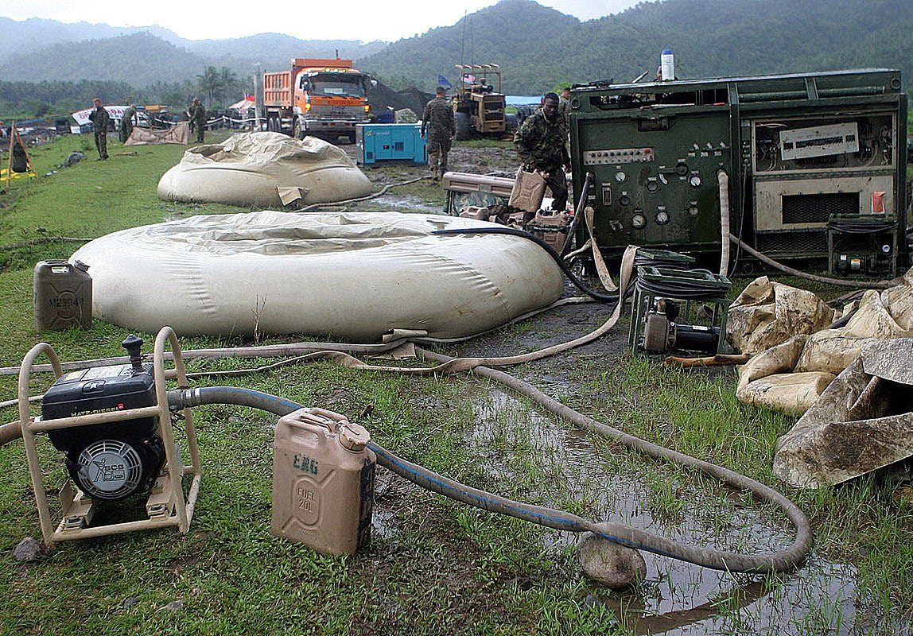
_CAPTION_

#### Duration

- Aufrechterhaltung von Standort
  - Personal
  - Zulieferer
  - eventuell internationale Partner

#### Dependency

- Verträge mit Zulieferern und Dienstleistern weit verbreitet, Contractor Support on Operations(CSO)
- Diese sind technisch gesehen keine Kombattanten, aber im Kriegsgebiet

### Doktrin

- Im Zweifelsfall in der Doktrin nachschauen
- Doktrin Lesen und Doktrin Anwenden
- 80/20 Kurzregel der Logistik
  - 80% ist Risikominimierung, die verbleibenden 20% sind das Risiko.
- GNLC Logistic Handbook, 2010
- Beispiele
  - Australian doctrine is very readable
  - US doctrine is unreadable
  - NATO doctrine is watered down
  - UK doctrine is ok

### 5 Lektionen aus der Ukraine

#### Tactical and operational effects of UAS

##### FPV Drohnen

- Geschwindigkeit 160km/h
- Lauern um Panzer und Bunker
- Alle Komponenten einfach Verfügbar
- Ukrainische Angriffszone, 10km Radius, 1500m Höhe

##### Preisvergleich

| Typ               | Preis (CHF) |
| ----------------- | ----------- |
| Artilleriegranate | 717-894     |
| Excalibur         | 89'000      |
| Javlin            | 178'000     |
| Drohne            | 358         |

##### Eigenschaften FPV Drohnen

- Trefferquote 10-80% (nicht alle explodieren)
- Statische Radiofrequenz kann gestört werden
- **Improved terminal guidance** Software-basierte Funkempfänger ermöglichen einfacheren Frequenzwechsel
- Benötigt Piloten mit Training und Erfahrung und Unterstützungseinheiten

##### Glasfaser FPV Drohnen

- Steuerungssignal über Kabel das von Spule in Drohne abgewickelt wird
- Reichweite 20km, in einem Wald bis zu 15km
- Kann nicht gestört werden durch elektronische Gegenmassnahmen
- Hochauflösende Datenübertragung über optischen Leiter

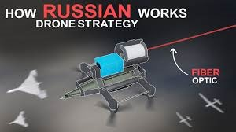  
_Funktionsprinzip der mit Glasfaser optisch gesteuerten Drohnen_

##### Autonome Drohne

- Einwegdrohne
- Video Ukrainer [hier](https://www.youtube.com/watch?v=tLUmv9TO9xU)
- 3kg Sprengstoff, bis zu 12km
- Ask: difference between kill chain and kill web?

##### Operational level systems

###### Bayraktar TB2

- Reichweite 150km
- Flughöhe 8km
- Flughöhe 4.5km
- Einsatzdauer 27h

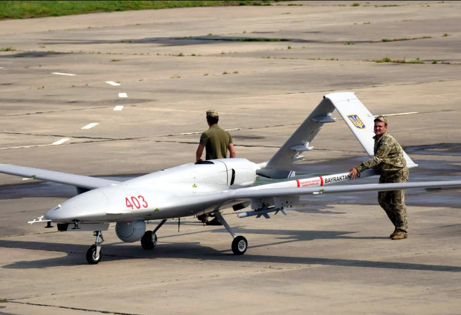

###### Harop

- Reichweite 1000km
- Einsatzdauer 9h
- Preis < $500k
- Erwartete Systemzeit 13 Jahre
- Komplett autonom
- Gewicht 40kg

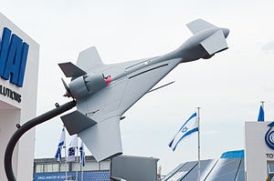

##### Medium Altitude Long Endurance (MALE) systems

- DX3, VTOL UAS: $200,000, 3 m wingspan, 1,500 km range
- QXX 222, VTOL, 0.85 Mach, can carry 2 x 250 kg bombs up to 2500 km

#### Transparent tactical battlespace

- Alles ist immer unter Beobachtung
- Tarnnetze reichen nicht, elektronische Signatur
- Kommandoposten anfällig, viel Wärme und Funkstrahlung

##### Planet satellites

- planet.com
- 180 Satelliten im Orbit
- Aktuelles Aufnahme mit 2 Meter Auflösung alle 24h (bald 6h)

#### Need to disperse, disaggregate but still be able to exercise C2

- Kein Hinterland mehr wegen erhöhter Reichweite und Aufklärung
- Ständiger Standortwechsel erschwert Command and Control C2

#### Medical support is difficult and has changed

- Medizinische Hilfen aus der Luft verunmöglicht
- Durchschnittliche Zeit UKR-Soldat bei "forward R2" nicht 2h sondern 15h

##### Medizinische Fernversorgung

- Medizinische Dienste sind limitiert durch Verbrauchsmaterialien (Class VIII) und chirurgische Fähigkeiten zur Schadensbegrenzung.
- Blutversorgung von entscheidender Bedeutung, besonders wenn keine Chirurgie vorhanden ist
- Begrenzt hilfreich sind "Laufende Blutbanken" Walking Blood Banks (WBB)

##### Blut zur Wiederbelebung

- Bedarf hoch bei intensiven Konflikten
- Statische brauchen etwa 20% der Verwundeten Blut
- Pro Verwundeten braucht es durchschnittlich 8 Einheiten Blut
- Bei 200 Verwundeten ergibt das einen Bedarf 320 Einheiten Blut
- A UK R2 Forward has 40 units per blood fridge
- **Es ist einfacher Blut nach Vorne zu senden als die gesamte Chirurgie**

#### Civilian contractors and conflict zones do not mix

- Contractor Support to Operations (CSO) hat seit dem zweiten Golfkrieg gut funktioniert
- hier nicht

## Der Bergkarabachkonflikt

### Leitfragen

- Welche Ziele verfolgen die Parteien im Bergkarabachkonflikt?
- Welche ausländischen Mächte unterstützten welche Kriegsparteien?
- Welche Rolle kommt der Technologie zu?

> Finally, we have crushed the head of the enemy with an "iron fist" and restored historical justice and national dignity.  
> \- _Ilham Aliyev, Präsident Aserbaidschans nach dem Ende der Operation "Iron Fist" 2020_

> We fell, but we did not kneel. We stood until the end and then made a decision not to fall into the abyss. This was a painful decision, but a necessary and inevitable one.  
> \- _Nikol Paschinjan, Premierminister Armeniens nach der Unterzeichnung des Waffenstillstandes im November 2020_

### Lektüre

- Ali Askerov/Gubad Ibadoghlu, The Causes and Consequences of the Second Karabakh War: September 27, 2021 - November 10, 2021, in: M. Hakan Yavuz/Michael Gunter (Hg.), The Nagorno-Karabakh Conflict: Historical and Political Perspectives, London 2022, S. 245-267.

### Vorgeschichte

- 1918: Gründung der Republiken GEO, ARM und AZE
- 1920: Anschluss der Region an Sowjetunion, autonome Oblast Bergkarabach (1923-1991)
- 1991: Zusammenbruch Sowjetunion, Deklaration Autonome Republik Berg-Karabach (seit 2017 Republik Arzach)
- Erster Bergkarabach-Krieg (1992-1994)

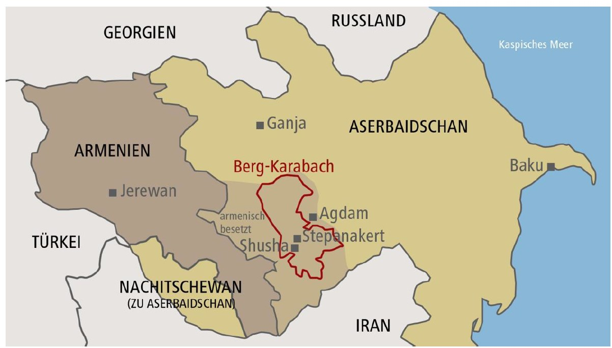
_Ausgangslage_

### Kriegsursachen

- Ungelöster Territorialdisput (frozen conflict)
- Militärische Aufrüstung
- Aussenpolitik Türkei
- Innenpolitische Spannungen in Aserbaidschan

### Kriegsauslöser

- Grenzscharmützel (Jul.)
- Militärübungen (Jul. - Sep.)
- Provokation von Schuscha (Aug.)

Aserbaidschansische Offensive, 27.09.2020, 8h03 (gem ARM)

Armenischer Beschuss gn Stellungen, 6h00 deshalb Gegenoffensive (gem AZE)

### Kriegsparteien

- Aserbaidschan hohes Budget, bessere Ausrüstung, Drohnen
- Armenien hat etwa gleich viel Soldaten, technisch unterlegen

### ODKB

- Militärisches Bündnis um Russland
- Armenien ist Teil davon
- Armenien hat sich dem Westen zugewannt
- Russland hat militärisch nicht interveniert

(Reihenfolge der letzten zwei Punkte unklar)

### Konfliktverlauf

- Kurz, 27.09.20-10.11.20

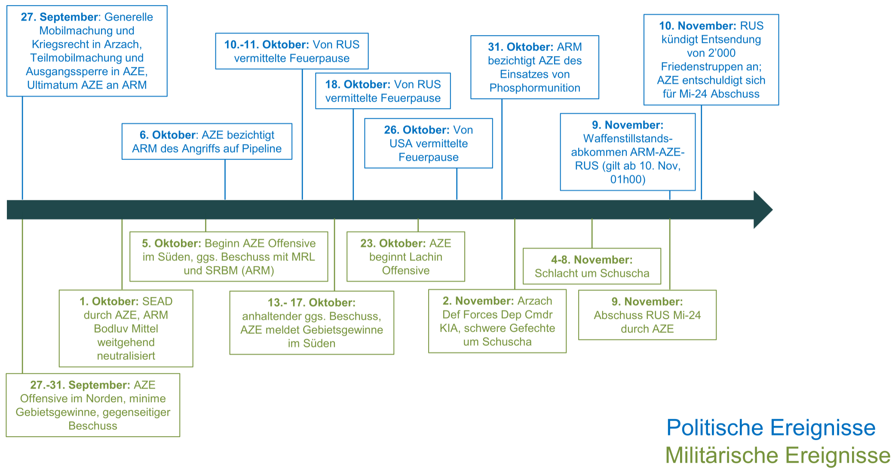
_CAPTION_

### Waffenstillstand

- Stadt Schuscha auf Hügel an strategisch wichtiger Lage
- Schnelle Einnahme durch Aserbaidschan
- Darauffolgend der Waffenstillstand

### Rückeroberung Bergkarabach 2023

- Seit Dezember 2022: Blockade der Republik Arzach durch AZE
- 19.09.2023: AZE bricht Waffenstillstand und greift Republik Arzach an
- 20.09.2023: Waffenstillstand unter russischer Vermittlung
- Verdacht auf ethnische Säuberungen und Völkermord an der armenischen Bevölkerung
- Flucht von über 100 000 armenischen Zivilisten

### Fazit

- Gekränkte Verlierer sind gefährliche Nachbaren, da sie auf Revanche aus sind (siehe Aserbaidschan)
- Externe Unterstützung kann kriegsentscheidend sein, ähnlich wie die Ausnutzung von Gelegenheitsfenstern (durch Aserbaidschan 2020 und 2023)
- Angriffsdrohnen ermöglichten Aserbaidschan die Schwächung der armenischen Verteidigung
- Traditionelle Luftverteidigung ist unzureichend, um gegen Angriffsdrohnen bestehen zu können
- Glaubwürdigkeit der Organisation des Vertrags über kollektive Sicherheit und Russlands als Schutzmacht (Armeniens) als Folge des Nichteingreifens geschwächt
- Lage in der Region bleibt volatil (Aliyev und Erdogan wollen Verbindung der Turk-Völker über Sangesur-Korridor, Iran will das verhindern, da einzige Landverbindung zu Russland)

## Der Ukrainekrieg

### Leitfragen

- Welche Ziele verfolgen die beiden Parteien im Ukrainekrieg?
- Wie hat sich die militärische Lage in den letzten drei Jahren verändert?
- Welche Rolle kommt dem globalen Süden zu?

> Der Krieg ist das Gebiet der Ungewissheit, drei Vierteile derjenigen Dinge, worauf das Handeln im Kriege gebaut wird, liegen im Nebel einer mehr oder weniger grossen Ungewissheit. Hier ist es also zuerst, wo ein feiner, durchdringender Verstand in Anspruch genommen wird, um mit dem Takte \[des\] Urteils die Wahrheit herauszufühlen.  
> \- _Carl von Clausewitz, Vom Kriege, Buch I, 3. Kapitel_

### Lektüre

- Franz-Stefan Gady/Michael Kofman, Ukraine’s Strategy of Attrition, in: Survival, Vol. 65 (2), 2023, S. 7-18.
- Walerij Saluschnyj, On the Modern Design of Military Operations in the Russo- Ukrainian War: In the Fight for the Initiative, 1. Februar 2024, [Artikel](https://s3.documentcloud.org/documents/24400154/ukraine-valerii-zaluzhnyi-essaydesign-of-war.pdf)

### Vorgeschichte

|      Datum | Ereignis                                                                                    |
| ---------: | ------------------------------------------------------------------------------------------- |
|    12.1991 | Referendum über Unabhängigkeit von Russland                                                 |
|    12.1994 | Budapester Memorandum                                                                       |
|    12.2004 | Präsidentschaftswahl ("Orange Revolution")                                                  |
|    01.2010 | Wahl des prorussischen Präsidenten Wiktor Janukowitsch                                      |
|    11.2013 | Beginn "Euromaidan"-Proteste                                                                |
|    02.2014 | Flucht und Absetzung Janukowitschs                                                          |
|    03.2014 | Besetzung der Krim durch Russland, Beginn des Krieges in der Ostukraine                     |
|    07.2014 | Abschuss eines Passagierfliegers der Malaysia Airlines                                      |
|    02.2015 | Minsker Abkommen                                                                            |
|       2017 | Ukrainisches Parlament einigt sich auf NATO-Mitgliedschaft als aussenpolitisches Ziel       |
|    05.2019 | Wahl Wolodymyr Selenskyi zum Präsidenten der Ukraine                                        |
| 21.02.2022 | Selenskyi widerspricht an Münchner Sicherheitskonferenz Budapester Memorandum (Atomdrohung) |
| 21.02.2022 | Russland anerkennt die Volksrepubliken Donezk und Luhansk als unabhängig                    |
| 22.02.2022 | USA, EU und Verbündete sanktionieren Russland                                               |
| 23.02.2022 | Putin kündigt eine militärische Spezialoperation an                                         |
| 24.02.2022 | Selenskyi ruft den Kriegszustand aus                                                        |

### Krieg als Mittel der russischen Aussen- und Innenpolitik

- Zweiter Tschetschenienkrieg 1999-2009
- Kaukasuskrieg 2008
- Annexion Krim, Krieg im Donbass 2014
- Syrienkrieg 2015 - heute?

### Kriegsziele Russlands

- Offiziell erklärt
  - Verhinderung Genozid im Donbass
  - Demilitarisierung und "Entnazifizierung" Ukraine
- Tatsächlich/verdeckt
  - Regierungsumsturz
  - Abkopplung Ukraine von NATO/EU, Schaffung Pufferzone
  - Wahrung russischer Einflussbereich

### Kriegsbeginn Winter-Frühling 2022

- Russische Hauptstösse auf vier Angriffsachsen

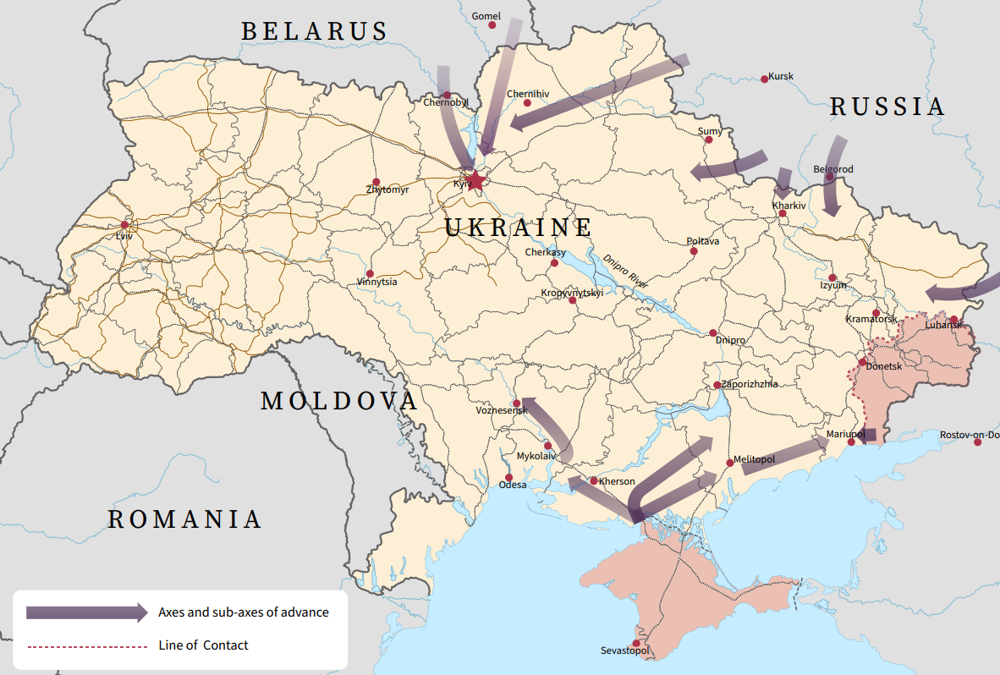

### Erkenntnisse nach Angriff

- Schwere Verletzung des Völkerrechts durch Russland, beschränkter Wert von Abkommen und Bündnissen
- Rohstoffabhängigkeit des Westens von Russland als Nachteil bei Verhängung von Sanktionen
- Wirtschaftssanktionen waren nur von beschränkter Wirkung
- Aufmarsch und Vorbereitung der russischen Streitkraft nahmen 3-4 Monate in Anspruch
- Angriff erfolgte entlang der gesamten Grenze (Norden, Osten, Süden) und verlief konzentrisch Richtung Hauptstadt
- "Hybride" Kriegsführung war nur mit starker konventioneller Komponente wirksam

### Strategiewechsel Sommer-Herbst 2022

- Fokus Donbass

### Gescheiterte Ukrainische Gegenoffensive 2023

- Minimale Erfolge, hoher Verlust an Material und Personal

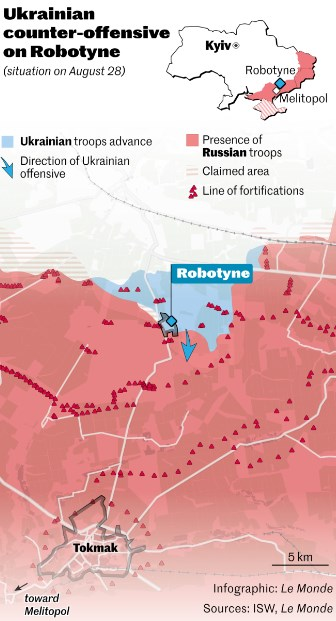

### Stellungskrieg 2023

### Weiter mit Stellungskrieg 2024

- 2 Ausnahmen

### Frozen Conflict 2025?

- Keith Kellog Version: Entmilitarisierte Zone von westlichen Friedenstruppen
  -ewacht
- Stabilisierte Frontlinie gekoppelt an finanzielle und militärische Unterstützung gegenüber der Ukraine
- Über 1000 Kilometer lange Bufferzone

| Vorstellung USA                      | Vorstellung Russland               |
| ------------------------------------ | ---------------------------------- |
| 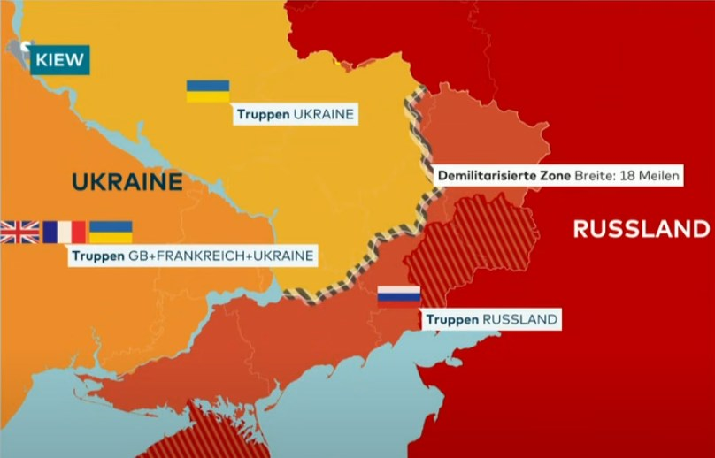 | 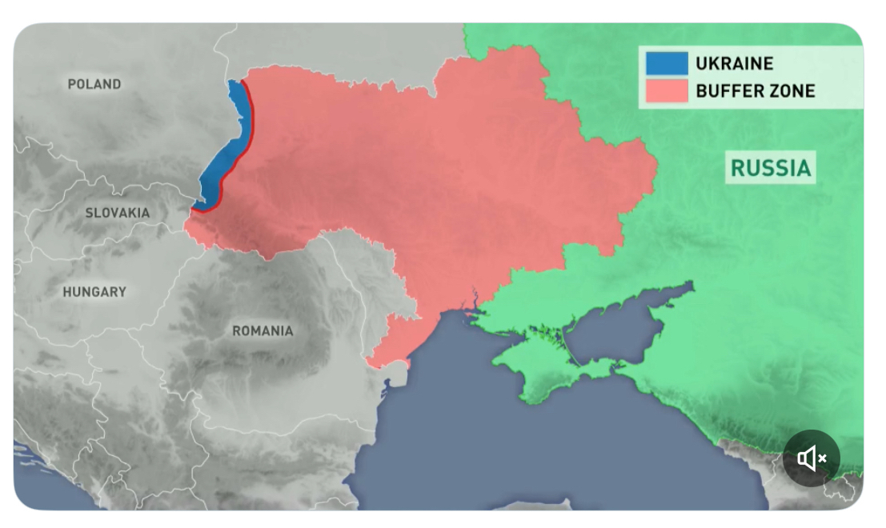 |

### Diplomatische Auswirkungen

- FOTO BRICS-Treffen Südafrika 2023
- Der amerikanische Ökonom Jim O'Neill sprach schon 2001 von BRICS

### Mögliche Entwicklung

#### Beschrieb

- Voraussetzungen

#### Russland gewinnt Krieg

- Einstellen der Unterstützung der Ukraine durch den Westen
- Kontinuierliche Unterstützung Russlands durch Partner
- Ukraine geht Munition und Material aus

#### Sturz des Regimes in Russland

- Russische Gebietsverluste
- Hohe russische Verluste
- Verschärfung der Sanktionen

#### Waffenstillstand

- Ukraine erleidet Rückschläge
- Russland erobert weitere Gebiete

#### Ukraine gewinnt Krieg

- Russland muss sich aus allen besetzten Gebieten zurückziehen
- Unterstützung der Ukraine hält an
- Kein Eingreifen von russischen Verbündeten
- Russland geht Munition, Material und qualifiziertes Personal aus

#### Russland setzt Massenvernichtungswaffen ein

- Gebietsverluste Russlands

#### Abnutzungskrieg entlang langer Frontlinie -

- Keiner Seite gelingt ein Durchbruch
- Beide Seiten halten an Kriegszielen fest

#### NATO wird zur Kriegspartei

- Russland setzt Massenvernichtungswaffen ein
- Russland greift NATO direkt an

### Fazit

- Der Ukrainekrieg wird in allen Domänen geführt.
- Es lässt sich eine Abfolge von verschiedenen Kriegsphasen mit wechselnden Dynamiken beobachten.
- Derzeit findet auf der strategischen Ebene ein Abnutzungskrieg statt, bei der die Kriegswirtschaft und die Unterstützung der Partner für beide Seiten elementar ist.
- Beide Seiten fürchten sich vor einer Eskalation, deshalb dürfte der Abnutzungskrieg weitergehen.

## Israels Mehrfrontenkriege

### Leitfragen

- Gegen welche Gegner kämpft Israel?
- Wie gestaltet sich die strategische Kultur Israels?
- Welche Rolle kommt der geographischen Lage Israels zu?

### Lektüre

- Michel Wyss, The October 7 Attack: An Assessment of the Intelligence Failings, in: CTC Sentinel, Vol. 17 (9), 2024, S. 1-7.
- Azar Gat, The Aims of the War in Gaza - and the Strategy for Achieving Them, 26.02.2024, [INSS](https://www.inss.org.il/publication/gaza-war-targets/)

### Geostrategische Lage

- Bewaffneter Konflikt seit Unabhängigkeitserklärung Israel im Mai 1948 (und bereits davor)
- Übergang von regulären zwischenstaatlichen Kriegen zu irregulärer Kriegführung
- Diplomatische Initiativen mit Teilergebnissen, aber kein Durchbruch bei Konfliktlösung

### Hamas ("Islamische Widerstandsbewegung")

- Gegründet 1987, Teil des globalen Muslimbruderschaftsnetzwerk
- Selbstmordattentate während erster und zweiter Intifada
- Sieg bei Parlamentswahlen 2006, Machtübernahme in Gaza 2007
- Spannungen zwischen politischem und militärischem Flügel

### Ausgangslage vor dem 7.10.2023

- Politisch:
  - Verwaltung statt Lösung Palästinenserkonflikt
  - Regionale Integration durch Normalisierung mit Golfstaaten
  - Justizreform und Massenproteste
- Militärisch:
  - Hamas und Hisbollah als lenkwaffen-basierte "Terror- Armeen"
  - Bisherige Verteidigungskonzeption nicht ausreichend
  - Lösungsansatz: Investitionen in Bodentruppen und Sensor- Verbund

### Der strategische Schock vom 7.10.2023

- Operation "AL-AQSA FLOOD"
  - Ausschalten von Verteidigungs-, und Überwachungssysteme
  - Vorrücken entlang gesamter Grenzlinie
- 07.10.2023 verlustreichster Tag in der Geschichte Israels
  - 1195 Tote (darunter zwei CH-Doppelbürger)
  - 251 Personen nach Gaza entführt

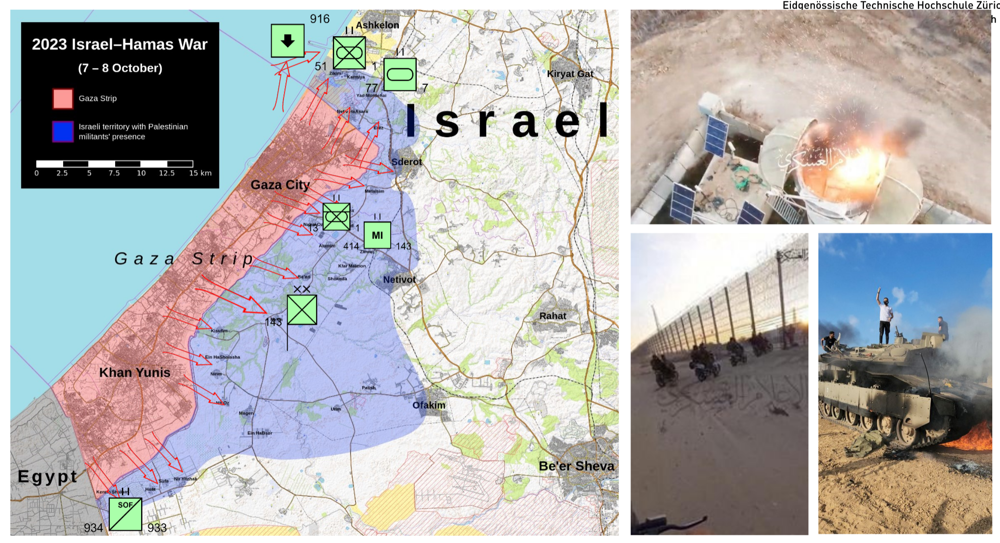
_Ausmass und Taktiken der Al-Aqsa Flutwelle_

### Israelische Reaktion

- Op "SWORDS OF IRON" blutigster Konflikt in Gaza
  - Über 50’000 Palästinenser getötet, mindestens die Hälfte Zivilisten
  - Humanitäre Katastrophe
- Ziele Gemäss Regierung
  - Zerstörung Hamas
  - Befreiung Geiseln
  - Wiederherstellung Abschreckungsfähigkeit IDF

### Auswirkungen des Gazakrieges

- Lokal
  - Eskalierende Spannungen und Gewalt im Westjordanland
  - Wirtschaftliche Kosten
  - Vertrauen in Regierung auf Tiefpunkt
- Regional
  - Gefahr zweiter Front im Norden
  - Indirekte Konfrontation mit Iran/Achse des Widerstands, insb. Hisbollah und Huthi
  - Normalisierung mit Saudi-Arabien sistiert, Spannungen mit regionalen Partnern
- Global
  - Einfluss USA auf Konfliktverlauf begrenzt
  - "Konkurrenz" mit Krieg in Ukraine
  - Polarisierung zwischen "Westen" und "globalem Süden"?

### Einsatz von KI

- Israel verwendet Künstliche Intelligenz "Gospel" (Infrastruktur) und "Lavender" (Personen) zur automatisierten Zielgenerierung
- Ca. 37’000 Personen waren auf automatisch generierten und von menschlicher Seite bestätigten Tötungslisten seitens Israels
- Früher hätten 20 ND-Spezialisten innerhalb von 300 Tagen ca. 20-30 Ziele generiert, mit der KI sind es in ca. 10 Tagen 200 Ziele (50x mehr) (Die Berechnung geht irgendwie nicht ganz auf)
- Hohe Zielgenerierung hat vermutlich zu mehr Beschuss in Gaza geführt

### Erneute Konfrontation in Gaza / Westjordanland

- Januar bis März 2025: Waffenstillstand mit Hamas in Gaza (Gefangenen-/Geiselaustausch)
- März 2025: Israel beginnt erneut mit Beschuss von Gaza und warnt vor erneutem Einmarsch und längerer Besetzung (mögl. als Druckmittel)
- Westjordanland: IDF beschiesst seit Oktober 2023 regelmässig Ziele im Westjordanland und hat dort seither über 10’000 Palästinenser festgenommen

### Konfrontation mit Iran 2024

- April: Israel bombardiert iranische Botschaft in Syrien und tötet ranghohe iranische Militärs
- April: Koordinierter Luftangriff Irans mit über 300 Drohnen und Raketen. Israel: Luftangriffe gegen Ziele im Iran, Irak und Syrien
- Juli und September: Israel tötet Haniyeh in Iran (Hamas Anführer) und Nasrallah (Hisbollah Anführer)
- Oktober: Iran beschiesst Israel mit über 200 Raketen in zwei Wellen. Israelische Luftangriffe auf Iran

### Konfrontation mit Hisbollah (Libanon)

- Nach 7.10.2023 Angriff beginnt Hisbollah hauptsächlich militärische Ziele in Israel zu beschiessen
- Viele kleinere grenzüberschreitende Bodenangriffe und weitere Raketenangriffe beider Seiten (steigende Zahl getöteter Zivilisten)
- Sept. und Okt. 2024: Operation «GRIM BEEPER»: «Pager-Attacke» auf Hisbollah Ziele. Anschliessende Invasion Südlibanons durch IDF. Tötung Nasrallahs (Hisbollah Chef)
- Seit November 2024 unruhiger Waffenstillstand (öfters gebrochen)

### Konfrontation mit Syrien

- Dezember 2024: Netanyahu erklärt Waffenruhe mit Syrien als gebrochen wegen Absetzung von Bashar al Assads Regime
- Dezember 2024: Start der Operation "ARROW OF BASHAN": Besetzung der demilitarisierten Golan Höhen und Raids bis nach Daraa
- März 2025: Netanyahu droht bis ca. 2 km vor Damaskus vorzudringen
- Ziel Israel: Demilitarisierung aller Gebiete südlich von Damaskus und Zerstörung von syrischem Material

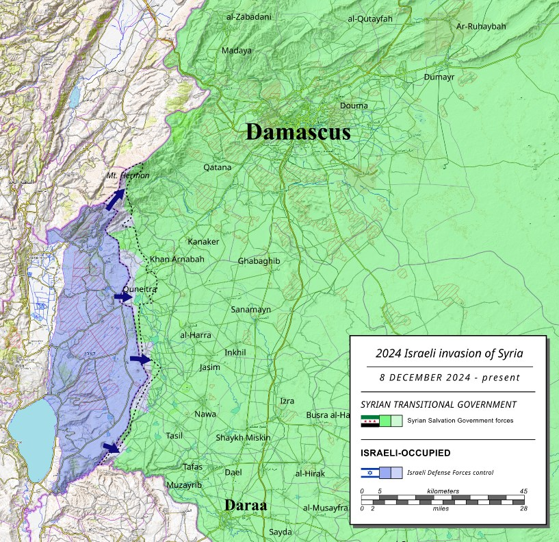
_Vorstoss Israels in Syrien_

### Konfrontation mit den Huthis (Jemen)

- Seit Oktober 2023 beschiessen Huthis regelmässig Schiffe im Roten Meer und Ziele in Israel (oft mit iranischen Drohnen und Raketen)
- Operation "PROSPERITY GUARDIAN": US geleitete multinationale Koalition zur Abwehr von Huthi Angriffen
- Juli 2024 und März 2025: Grössere Drohnenangriffe der Huthis auf Tel Aviv und Jerusalem (Israel)
- Wiederholte Luft- und Raketenangriffe von Israel und USA auf die Huthis zeigen wenig Effekt

### Fazit

- Israels vielschichtige Mehrfrontenkriege gehen weiter
- Strategische Kultur der Offensive (ohne Verteidigung in der Tiefe) prägt Israel
- Latente Feindschaft Iran vs. Israel beeinflusst den Nahen Osten weiterhin. Derzeit hat Israel allerdings eine stärker Position als in der Vergangenheit
- Gaza: Von der Belagerung zur Okkupation
- Westjordanland: Beide Seiten beschiessen einander regelmässig
- Hisbollah: Nach "Pager"-Angriff massgeblich geschwächt, brüchiger Waffenstillstand
- Iran: Die Luftangriffe hat Israel gemeinsam mit den Verbündeten abgewehrt
- Syrien: Israelische Intervention nach dem Fall Assads
- Jemen: Latente Luftangriffe auf Huthi-Ziele

## Der syrische Bürgerkrieg und der Fall Assads

### Leitfragen

- Welche Ziele verfolgten die verschiedenen Parteien im syrischen Bürgerkrieg?
- Weshalb wurde Assad im Dezember 2024 schnell gestürzt?
- Wie könnte sich die humanitäre Lage in Syrien weiterentwickeln?

### Lektüre

- Natasha Hall, With the Fall of Assad, Can Syria Rise?, in: Survival, Vol. 67 (1), 2025, S. 45-54.
- Christopher Phillips, The International System and the Syrian Civil War, in: International Relations, Vol. 36 (3), 2022, 358-366, 374-377.

### Vorgeschichte Irak und Syrien

#### Von JTJ zum "Islamischen Staat"

- Jama’at al-Tawhid wal-Jihad 1999–2004
- Al-Qaida im Irak (AQI) 2004–2006
- Islamischer Staat des Irak (ISI) 2006–2013
- ISIS(yrien) 2013-2014
- Islamischer Staat seit Juni 2014
  - Ernennung von Kalif Abu Bakr Al-Baghdadi

#### Krieg 2014

##### Ursachen

- Jihadistisch-salafistische Ideologie
- Konfessioneller Antagonismus (Schiiten vs. Sunniten)
- Diskriminierung sunnitischer Iraker, "De-Ba'athifizierung"
- Abzug US-Streitkräfte aus Irak
- Territorialer Herrschaftsanspruch

##### Auslöser

- Spaltung zwischen Jabhat al-Nusra und ISIS
- Ausschluss von ISIS bei Al-Qaida (innerjihadistischer Konflikt)
- ISIS-Offensive in Syrien und Nordirak (Einnahme von Mosul)
- Genozid an Jesiden und Christen
- Kriegsverbrechen, Terror und Schreckensherrschaft

### Kriegsparteien im syrischen Bürgerkrieg

- Assad-Regime
  - Syrische Arabische Armee SAA
  - Hisbollah
  - Iran (hauptsächlich Revolutionsgarden)
  - Russland
- Globale Dschihadbewegung
  - Islamischer Staat
  - Tanzin Hurras al-Din
  - zahlreiche kleinere Gruppierungen
- Kurden, weitere Minderheiten
  - Volksverteidigungseinheiten YPG
  - Assyrischer Militärrat
  - Demokratische Kräfte Syrien SDF
- Sunnitische Rebellengruppen
  - Syrische Nationale Armee SNA
  - Ahrar ash-Sham
  - Ha’yat Tahrir ash-Sham HTS
  - Türkei
  - Golf-Staaten
  - Jordanien

### Syrische Rebellengruppe HTS

- Hai'at Tahrir asch-Scham
- Ehemalige Al-Qaida-Mitgliedsorganisation, treibende Kraft der syrischen Opposition
- Angeführt vom 42-jährigen Abu Mohammed al-Julani
- Die USA, die UNO und andere haben HTS als Terrorgruppe eingestuft
- Ziele
  - Sturz Assad und Aufbau eines islamischen Staates
  - Legitimität, Distanzierung von al-Qaida und Konsolidierung

### Syrische Nationale Armee SNA

- Ging ursprünglich aus desertierten Soldaten hervor, die sich in der Free Syrian Army (FSA) zusammenschlossen
- Stark von der Türkei unterstützt
- Ziele
  - Sturz des syrischen Regimes
  - Kampf gegen kurdische Autonomiebestrebungen im Norden und Osten Syriens

### Southern Operations Room

- Erreichte nach dem Sturz Assads vor den HTS- Kämpfern Damaskus
- Kämpfte im Süden Syriens gegen die Dschihadisten des IS
- Netzwerk aus verschiedenen kleinen und Kleinstgruppen
- Ziele
  - Sturz des syrischen Regimes
  - Freies und vereintes Syrien

### Islamisten/Dschihadisten

- Al-Kaida wollte Anfang der 2010er-Jahre Syrien als Rückzugsgebiet nutzen, stiess jedoch ab 2014 auf den IS
- Der IS wurde in seinem Kerngebiet südlich von Rakka durch eine westliche Allianz besiegt
- Künftige Rolle des IS in Syrien ist derzeit unklar
- Laut dem Islamwissenschaftler Reinhard Schulze hat der IS noch 8.000 - 20.000 Kämpfer
- Ziele:
  - Wiederaufbau des Kalifats
  - Kontrolle von Ressourcen und Rekrutierung von Kämpfern

### Kurden

- Zwei Lager:
  - Syrischen Demokratischen Kräfte (SDF)
  - Volksverteidigungseinheiten (YPG)
- YPG hat Verbindungen zur PKK (derzeit in Auflösung)
- Während der Assad-Jahre wurde die YPG teilweise vom Regime geduldet
- Ziele:
  - Autonomie und Selbstverwaltung in den nördlichen Gebieten
  - Wahrung kurdischer Identität
  - Föderalisierung Syriens

### Die alten Eliten des Regimes

- Alewitische Familie Assad regierte 54 Jahre lang mit der Baath-Partei
- Stützte sich auf einen geheimdienstlich gelenkten Unterdrückungsstaat mit sunnitischen Eliten
- Syrische Armee war relativ schwach
- Ziele:
  - Machterhalt und Unterdrückung der Proteste
  - Sicherung alawitischer Machtbasis

### Türkei

- Mehrere grenzüberschreitende Operationen
- Türkisches Vorgehen wurde in der Vergangenheit immer wieder kritisiert
- Russische Unterstützung Assads als Rückschlag, trotzdem "Kooperation" mit Russland ab 2016
- Ziele:
  - Bekämpfung der Kurden und Verhinderung eines kurdischen Staates
  - Bekämpfung IS
  - Zu Beginn: Sturz Assads
  - Kontrolle Flüchtlingsströme

### Situation auf dem Boden

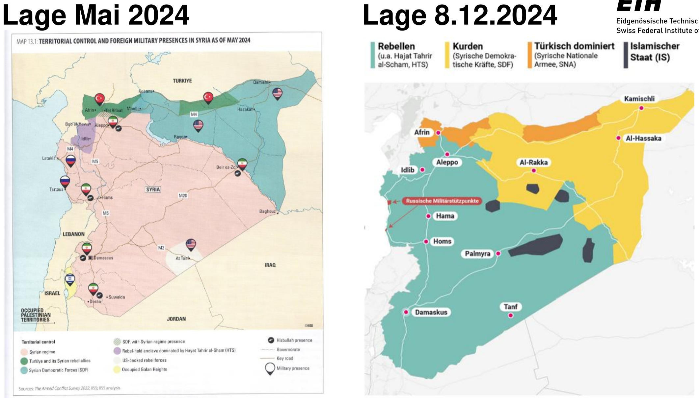

### Anlage der Operation

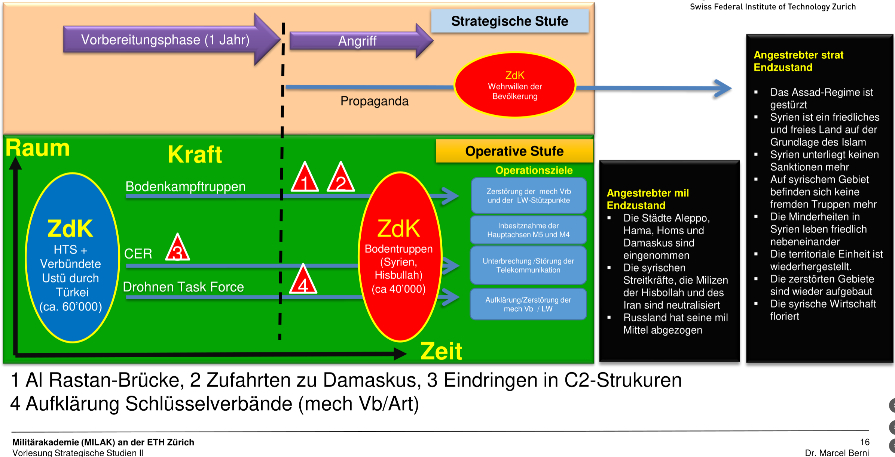
_Strategisches Schema des von HTS geführten und mit Verbündeten umgesetzten Regimewechsels_

### Vier Szenarien

#### Teilung Syriens

- Politische Stabilität durch Rebellen
- Autonome Kurdengebiete
- Anfang einer syrischen Föderation
- Verbesserung humanitäre Lage

#### Kampf um die Kurdengebiete

- Türkei unterstützt HTS
- SNA greifen kurdische Gebiete an
- IS erstarkt als Folge der Schwächung der Kurden
- Verschlechterung humanitäre Lage

#### Zerstückelung

- Kein Gewaltmonopol
- Zerfall in Gebiete unter Herrschaft lokaler Warlords
- Anstieg Einfluss IS
- Verschlechterung humanitäre Lage

#### Chaos

- Rivalisierende Parteien
- Angriff auf kurdische Gebiete
- Erstarkung des IS
- Katastrophale humanitäre Lage

### Fazit

- Der syrische Bürgerkrieg begann 2011 im Rahmen des Arabischen Frühlings
- Der IS nutzte das vom Bürgerkrieg destabilisierte Syrien, um an Einfluss, Kämpfer und Ressourcen zu gewinnen
- Der IS verfolgte zu hochgesteckte, fanatische Ziele (ends), die sich nicht mit den zur Verfügung stehenden Mitteln (means) und Methoden (ways) erreichen liessen. Die angewandten Mittel bewirkten das Gegenteil und stärkten die mannigfaltigen Gegner, die das Centrum gravitatis (= Kontrolle des Territoriums) erfolgreich bekämpften.
- Im November/Dezember 2024 gelang es der HTS mit türkischer Unterstützung, die Assad-Dynastie nach über 50 Jahren Herrschaft mit einer kurzen Blitzoffensive zu stürzen und den Bürgerkrieg (vorläufig) zu beenden

## Chinas Grossmachtambitionen

mit MA Matthias Schachtler

### Leitfragen

- Welche strategischen Ziele verfolgt die VR China?
- Welche technologischen Innovationen nutzt China derzeit?
- Welche Rolle kommt dabei Xi Jinping zu?

### Lektüre

- Joel Wuthnow/M. Taylor Fravel, China’s Military Strategy for a ‘New Era’: Some Change, More Continuity, and Tantalizing Hints, in: Journal of Strategic Studies, 46 (6-7), 2023, S. 1149-1184.

### Chinas Grand Strategy

#### Drei Theorien

- China hat keine Grand Strategy
- Chinas Grand Strategy ist nur lokal (Taiwan, Japan, Indien, SCS)
- Chinas Grand Strategy ist global (Belt and Road, Djibouti, etc.)

#### Grand Strategy global, aber militärisch lokal?

- Deng Xiaoping: "hide capabilities and bide time"
- Das Traumatic Trifecta und der "Neue Kalte Krieg"
- Chinas Strategie für Deplazierung des US "Hegemon" (Doshi)
  - Blunting / Abstumpfen (1989 – 2008)
  - Building / Bauen (2008 – 2016)
  - Expanding / Expandieren (2016 – jetzt)

### Strategie im Bürgerkrieg

- Ende der Qing Dynastie; Nationalisten übernehmen (1912)
- Gründung nationalistische Partei (1919)
- Gründung CCP (1921) und PLA (1927)
- Strategie im Bürgerkrieg (1927–1936, 1945–1949)
  - Active Defence (mobile Kriegsführung: Verteidigung, Bewegung, Konter)
  - Luring the Enemy in Deep (bekanntes Terrain, Ressourcen)
  - People’s War (Guerilla Kriegsführung, politische Kommissar)
- Gründung People’s Republic of China (1949) und Rückzug von Chiang Kai-Sheks Nationalisten nach Taiwan (1949)

### Entwicklung Strategischer Richtlinien

| Jahr | Doktrin in Schlagwort Zusammengefasst                            |
| ---: | :--------------------------------------------------------------- |
| 1956 | "Defending the motherland" vs. US                                |
| 1960 | "Resist in the north, open in the south"                         |
| 1964 | "Luring the enemy in the deep" (by Mao)                          |
| 1977 | "Active defense, luring the enemy in the deep"                   |
| 1980 | "Active Defense" vs. USSR, unofficial focus since 1969           |
| 1988 | "Dealing with local wars and military conflicts"                 |
| 1993 | "Winning local wars under high-technology conditions" vs. Taiwan |
| 2004 | "Winning local wars under informatized conditions"               |
| 2014 | "Winning informatized local wars" (Xi Jinping in power)          |
| 2019 | "Strategic guidelines for a new era" (important shift or not?)   |

### PLA und CCP-Führung

| Name          |        von |             bis |
| ------------- | ---------: | --------------: |
| Mao Zedong    |       1954 |            1976 |
| Deng Xiaoping |       1979 | (oder 97?) 1993 |
| Jiang Zemin   | 27.03.1993 |      15.03.2003 |
| Hu Jintao     | 15.03.2003 |      14.03.2013 |
| Xi Jinping    | 14.03.2013 |           jetzt |

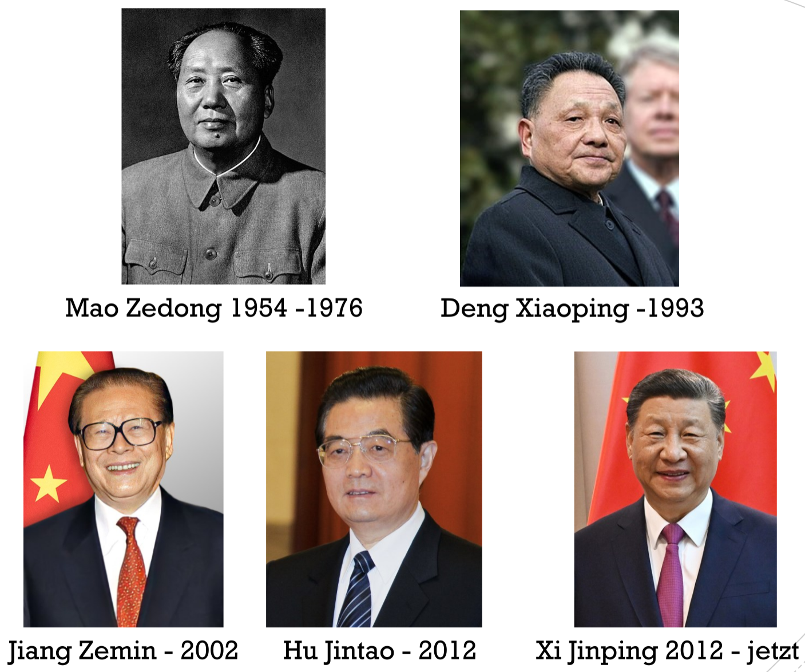

### PLA Modernisierung unter Xi Jinping

#### Ziele

- Verschlankung der PLA
- Loyalität gegenüber CCP und Xi
- PLA soll "red" und "expert" sein
- Korruptionsbekämpfung
- Besser Joint-Operations
- Modernisierung PLA-Material

#### 2015 Reformen

- Neue CMC-Aufstellung
- Auflösung der General Departements
- Reorganisation der Theatre Commands
- Gründung der Strategic Support Force (spätere Abschaffung)
- Kürzung von 300’000 Soldaten (Stärkung der Unteroffiziere)

### PLA heute

- Verwaltung: Central Military Commission (CMC)
- CMC-Führung: Xi Jinping
- Budget 2025: 246 Milliarden $ (?)
- Wehrpflicht: Ja, aber hauptsächlich Freiwillige
- Grösse: 2 Million aktiv, 500 000 Reserve  
  (plus 10 Millionen weitere bewaffnete Verbände)

### Militärstruktur Stand 2025

#### Four Services

- Ground Force PLAGF (grün)
- Navy PLAN (blau-weiss)
- Air Force PLAAF (hellblau)
- Rocket Force PLARF (gelb)

#### Four Arms (new)

- Aerospace Force
- Cyberspace Force
- Information Support
- Joint Logistics Support

#### Weitere bewaffnete Verbände

- People's Armed Forces Militia (8 Millionen)
- Peoples Armed Police (PAP) (1,5 Millionen)
- Coast Guard

#### Einteilung in 5 Territorien

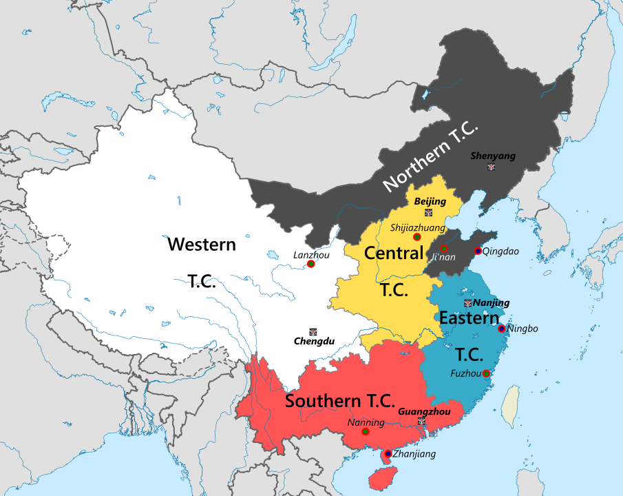

#### Chinas Militär-Struktur

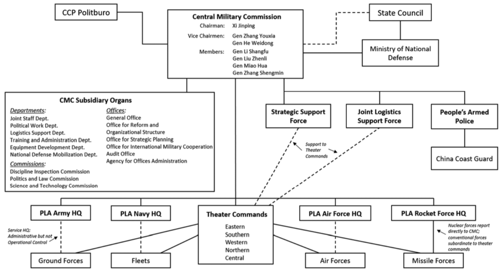

### PLA Material Modernisierung

- Type 055 Cruiser
- Dongfeng 21 "Carrier Killer"
- Shenyang J-35 Kampfjet
- Fuijan Flugzeugträger
- Landebrückenschiffe
- Drohnenträgerdrohnen

### Krisen in der Taiwanstrasse

- 1954 Erste Taiwanstrassenkrise (Bomb. Kinmen und Matsu)
- 1958 Zweite Taiwanstrassenkrise (Luft- und Seegefechte)
- 1994 Dritte Taiwanstrassenkrise (Lee Teng-Hui in USA)
- 2022 Vierte Taiwanstrassenkrise (Nancy Pelosi in Taiwan)

### Taiwan Invasion

- Beiping (Beijing) Modell für Invasion
- Ausmass einer Taiwan Invasion
  - Operation Causeway (US Pläne japanisch kontrolliertes Taiwan zu erobern mit 5 zu 1 Ratio)
  - Operation Overlord (zuerst 160k, dann 800k Alliierte)
  - Operation Iceberg (Schlacht um Okinawa mit 180k USA)
- Schwierigkeiten der Invasion (Formation, Gezeiten etc.)

### China Taiwan Vergleich

- China qualitativ und qualitativ in allen Bereichen deutlich überlegen
- Taiwan mit starken geographischen Vorteilen

### Fazit

- Chinesische Grossmachtambitionen scheinen realistisch
- China momentan hauptsächlich regionale Militärmacht
- Taiwan Invasion ist möglich aber extrem kostspielig
- Schwierig einzuschätzen, wie kampftüchtig die PLA ist

## Überblickswerke zur Strategiegeschichte

- [ ] Jan Angstrom, J.J. Widen, Contemporary Military Theory: The Dynamics of War, London 2015. [ ] John Baylis et al. (Hg.), Strategy in the Contemporary World. An Introduction to Strategic Studies, Oxford/New York 2019.
- [ ] Jeremy Black, Military Strategy. A Global History, New Haven 2020.
- [ ] Hal Bands (Hg.), The New Makers of Modern Strategy, Princeton 2023.
- [ ] Hervé Coutau-Bégarie, Traité de stratégie, Paris 2002.
- [ ] Nathan K. Finney (Hg.), On Strategy. A Primer, Fort Leavenworth 2020.
- [ ] Lawrence Freedman, Strategy. A History, New York 2013.
- [ ] Beatrice Heuser, Den Krieg denken. Die Entwicklung der Strategie seit der Antike, Paderborn 2010.
- [ ] David Jordan et al., Understanding Modern Warfare, Cambridge 2016.
- [ ] Thomas G. Mahncken, Joseph A. Maiolo (Hg.), Strategic Studies. A Reader, London 2008.
- [ ] Peter Paret (Hg.), Makers of Modern Strategy. From Machiavelli to the Nuclear Age, Princeton 1986.
- [ ] Elinor C. Sloan, Modern Military Strategy. An Introduction, Oxon/New York 2017.

## Sprechstunden

Sprechstundentermine können bei Bedarf individuell vereinbart werden.  
Bitte setzen Sie sich mit dem Dozenten in Verbindung: <marcel.berni@milak.ethz.ch>
